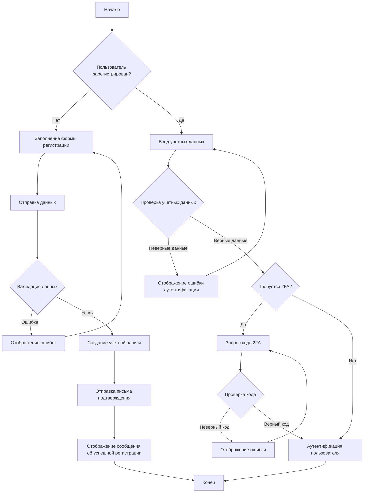
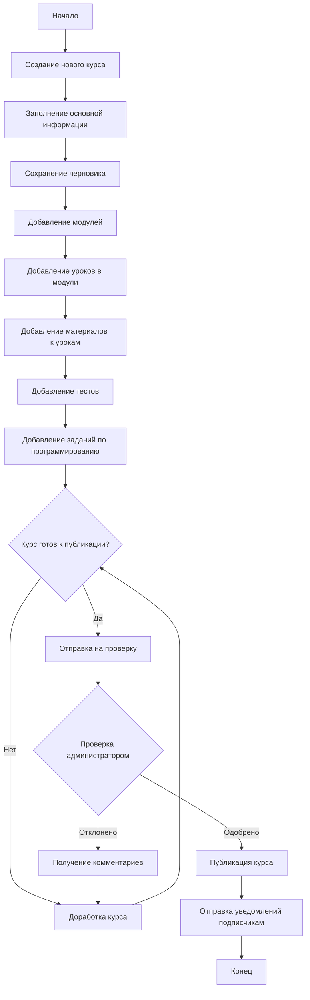
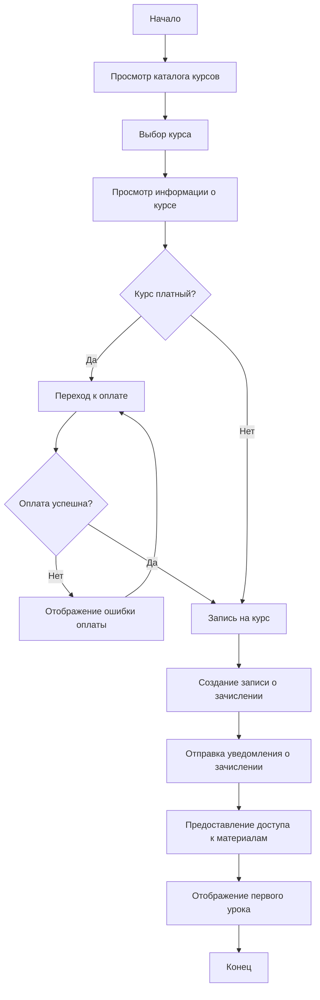
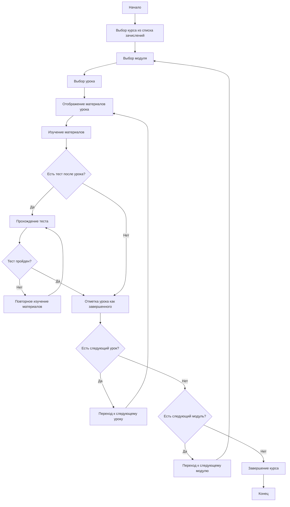
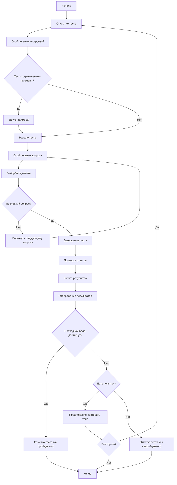
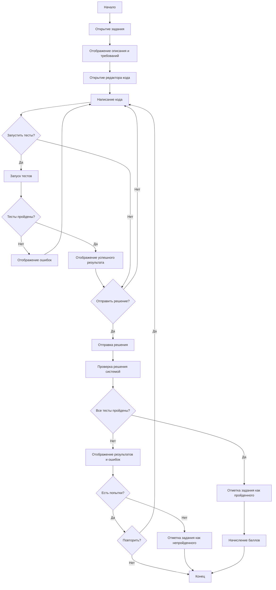
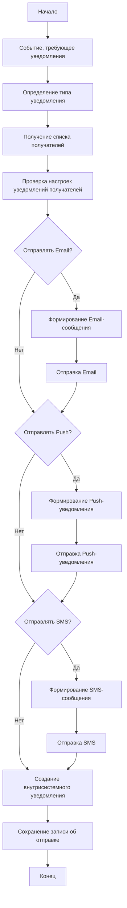

# Диаграммы активности AiTestPlatform

В этом документе представлены диаграммы активности (Activity Diagrams) для визуализации основных процессов системы AiTestPlatform.

## Содержание

1. [Регистрация и аутентификация пользователя](#регистрация-и-аутентификация-пользователя)
2. [Создание и публикация курса](#создание-и-публикация-курса)
3. [Запись студента на курс](#запись-студента-на-курс)
4. [Прохождение урока](#прохождение-урока)
5. [Прохождение теста](#прохождение-теста)
6. [Выполнение задания по программированию](#выполнение-задания-по-программированию)
7. [Выдача сертификата](#выдача-сертификата)
8. [Отправка уведомлений](#отправка-уведомлений)

## Регистрация и аутентификация пользователя



## Создание и публикация курса



## Запись студента на курс



## Прохождение урока



## Прохождение теста



## Выполнение задания по программированию



## Выдача сертификата

```mermaid
flowchart TD
    A[Начало] --> B{Все требования курса выполнены?}
    B -->|Нет| C[Отображение невыполненных требований]
    C --> D[Конец]
    
    B -->|Да| E[Запрос на генерацию сертификата]
    E --> F[Проверка данных пользователя]
    
    F --> G{Данные корректны?}
    G -->|Нет| H[Запрос на обновление данных]
    H --> I[Обновление данных]
    I --> F
    
    G -->|Да| J[Генерация сертификата]
    J --> K[Создание уникального кода верификации]
    K --> L[Сохранение сертификата в системе]
    
    L --> M[Отправка сертификата пользователю]
    M --> N[Отправка уведомления о выдаче сертификата]
    
    N --> O[Обновление статуса курса на "Завершен"]
    O --> P[Конец]
```

## Отправка уведомлений



## Заключение

Диаграммы активности (Activity Diagrams) предоставляют наглядное представление о последовательности действий и потоке управления в основных процессах системы AiTestPlatform. Они помогают понять:

1. Последовательность шагов в каждом процессе
2. Точки принятия решений и ветвления процессов
3. Параллельные действия, если они присутствуют
4. Взаимодействие между различными компонентами системы

Эти диаграммы являются важным инструментом для разработчиков и аналитиков, позволяя им лучше понять поведение системы и правильно реализовать бизнес-логику, связанную с основными процессами.