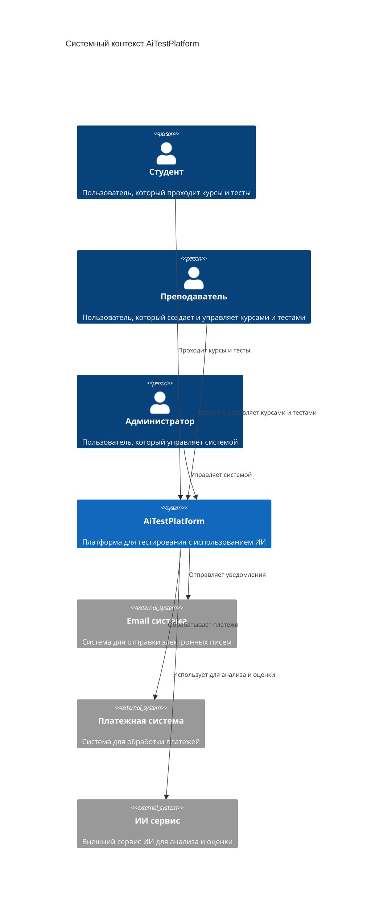
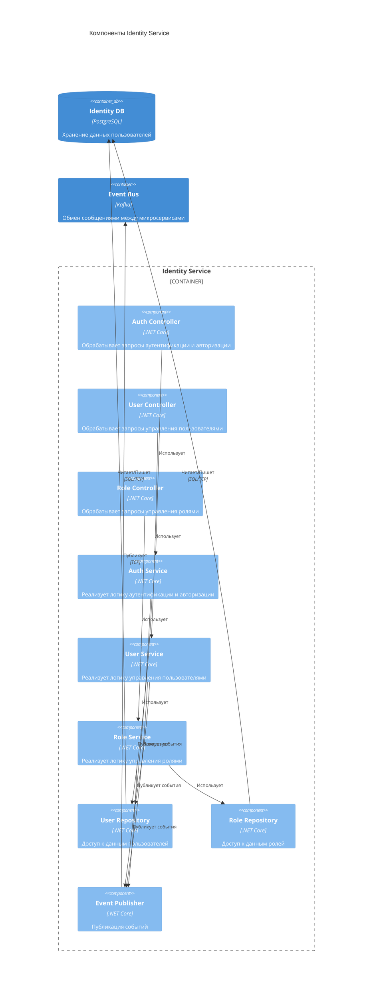
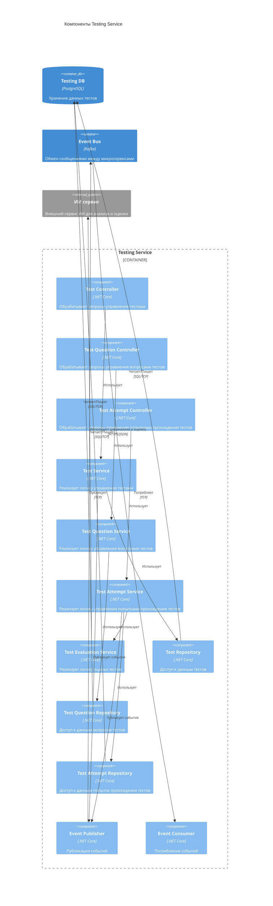
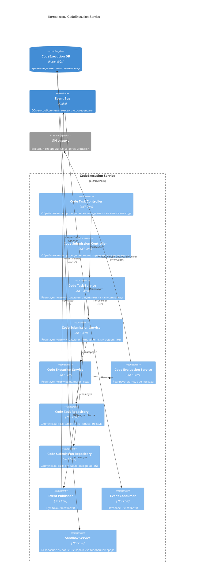
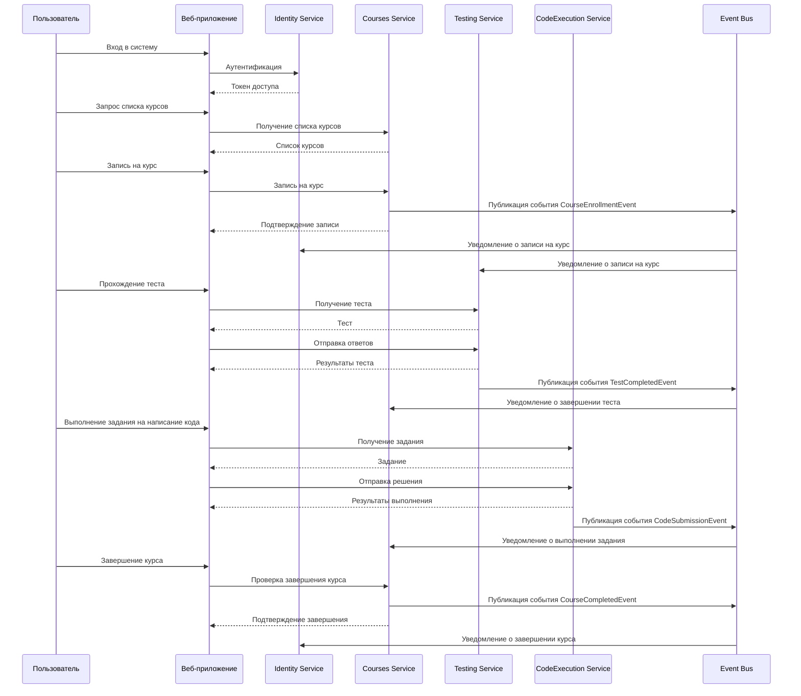
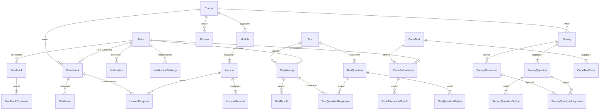
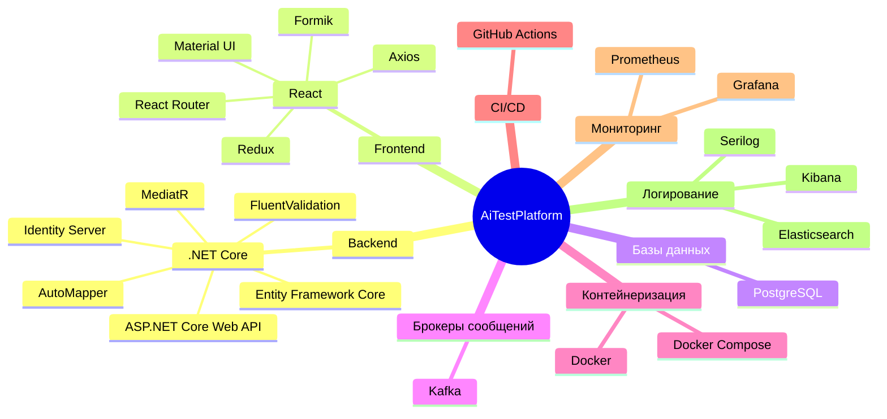

# Архитектура проекта AiTestPlatform

## Содержание

1. [Общее описание](#общее-описание)
2. [Системный контекст (C4 модель)](#системный-контекст-c4-модель)
3. [Контейнеры (C4 модель)](#контейнеры-c4-модель)
4. [Компоненты (C4 модель)](#компоненты-c4-модель)
5. [Взаимодействие микросервисов](#взаимодействие-микросервисов)
6. [Структура данных](#структура-данных)
7. [Технологический стек](#технологический-стек)

## Общее описание

AiTestPlatform - это комплексная платформа для тестирования с использованием искусственного интеллекта, построенная на микросервисной архитектуре. Система предназначена для создания, управления и прохождения образовательных курсов с интегрированной системой тестирования и выполнения кода.

## Системный контекст (C4 модель)

## Контейнеры (C4 модель)

```mermaid
C4Container
    title Контейнеры AiTestPlatform
    
    Person(student, "Студент", "Пользователь, который проходит курсы и тесты")
    Person(instructor, "Преподаватель", "Пользователь, который создает и управляет курсами и тестами")
    Person(admin, "Администратор", "Пользователь, который управляет системой")
    
    System_Boundary(aiTestPlatform, "AiTestPlatform") {
        Container(webApp, "Веб-приложение", "React", "Пользовательский интерфейс системы")
        
        Container(identityService, "Identity Service", ".NET Core", "Управление пользователями, аутентификация и авторизация")
        Container(coursesService, "Courses Service", ".NET Core", "Управление курсами, модулями и уроками")
        Container(testingService, "Testing Service", ".NET Core", "Создание и проведение тестов, оценка результатов")
        Container(codeExecutionService, "CodeExecution Service", ".NET Core", "Выполнение и проверка кода")
        
        Container(eventBus, "Event Bus", "Kafka", "Обмен сообщениями между микросервисами")
        
        ContainerDb(identityDb, "Identity DB", "PostgreSQL", "Хранение данных пользователей")
        ContainerDb(coursesDb, "Courses DB", "PostgreSQL", "Хранение данных курсов")
        ContainerDb(testingDb, "Testing DB", "PostgreSQL", "Хранение данных тестов")
        ContainerDb(codeExecutionDb, "CodeExecution DB", "PostgreSQL", "Хранение данных выполнения кода")
    }
    
    System_Ext(emailSystem, "Email система", "Система для отправки электронных писем")
    System_Ext(paymentSystem, "Платежная система", "Система для обработки платежей")
    System_Ext(aiService, "ИИ сервис", "Внешний сервис ИИ для анализа и оценки")
    
    Rel(student, webApp, "Использует", "HTTPS")
    Rel(instructor, webApp, "Использует", "HTTPS")
    Rel(admin, webApp, "Использует", "HTTPS")
    
    Rel(webApp, identityService, "Вызывает API", "HTTPS/JSON")
    Rel(webApp, coursesService, "Вызывает API", "HTTPS/JSON")
    Rel(webApp, testingService, "Вызывает API", "HTTPS/JSON")
    Rel(webApp, codeExecutionService, "Вызывает API", "HTTPS/JSON")
    
    Rel(identityService, identityDb, "Читает/Пишет", "SQL/TCP")
    Rel(coursesService, coursesDb, "Читает/Пишет", "SQL/TCP")
    Rel(testingService, testingDb, "Читает/Пишет", "SQL/TCP")
    Rel(codeExecutionService, codeExecutionDb, "Читает/Пишет", "SQL/TCP")
    
    Rel(identityService, eventBus, "Публикует/Подписывается", "TCP")
    Rel(coursesService, eventBus, "Публикует/Подписывается", "TCP")
    Rel(testingService, eventBus, "Публикует/Подписывается", "TCP")
    Rel(codeExecutionService, eventBus, "Публикует/Подписывается", "TCP")
    
    Rel(coursesService, emailSystem, "Отправляет уведомления", "SMTP")
    Rel(coursesService, paymentSystem, "Обрабатывает платежи", "HTTPS/JSON")
    Rel(testingService, aiService, "Использует для анализа и оценки", "HTTPS/JSON")
    Rel(codeExecutionService, aiService, "Использует для анализа и оценки", "HTTPS/JSON")
```

## Компоненты (C4 модель)

### Identity Service

### Courses Service

```mermaid
C4Component
    title Компоненты Courses Service
    
    Container_Boundary(coursesService, "Courses Service") {
        Component(courseController, "Course Controller", ".NET Core", "Обрабатывает запросы управления курсами")
        Component(moduleController, "Module Controller", ".NET Core", "Обрабатывает запросы управления модулями")
        Component(lessonController, "Lesson Controller", ".NET Core", "Обрабатывает запросы управления уроками")
        Component(enrollmentController, "Enrollment Controller", ".NET Core", "Обрабатывает запросы управления записями на курсы")
        Component(feedbackController, "Feedback Controller", ".NET Core", "Обрабатывает запросы управления обратной связью")
        Component(notificationController, "Notification Controller", ".NET Core", "Обрабатывает запросы управления уведомлениями")
        Component(certificateController, "Certificate Controller", ".NET Core", "Обрабатывает запросы управления сертификатами")
        
        Component(courseService, "Course Service", ".NET Core", "Реализует логику управления курсами")
        Component(moduleService, "Module Service", ".NET Core", "Реализует логику управления модулями")
        Component(lessonService, "Lesson Service", ".NET Core", "Реализует логику управления уроками")
        Component(enrollmentService, "Enrollment Service", ".NET Core", "Реализует логику управления записями на курсы")
        Component(feedbackService, "Feedback Service", ".NET Core", "Реализует логику управления обратной связью")
        Component(notificationService, "Notification Service", ".NET Core", "Реализует логику управления уведомлениями")
        Component(certificateService, "Certificate Service", ".NET Core", "Реализует логику управления сертификатами")
        
        Component(courseRepository, "Course Repository", ".NET Core", "Доступ к данным курсов")
        Component(moduleRepository, "Module Repository", ".NET Core", "Доступ к данным модулей")
        Component(lessonRepository, "Lesson Repository", ".NET Core", "Доступ к данным уроков")
        Component(enrollmentRepository, "Enrollment Repository", ".NET Core", "Доступ к данным записей на курсы")
        Component(feedbackRepository, "Feedback Repository", ".NET Core", "Доступ к данным обратной связи")
        Component(notificationRepository, "Notification Repository", ".NET Core", "Доступ к данным уведомлений")
        Component(certificateRepository, "Certificate Repository", ".NET Core", "Доступ к данным сертификатов")
        
        Component(eventPublisher, "Event Publisher", ".NET Core", "Публикация событий")
        Component(eventConsumer, "Event Consumer", ".NET Core", "Потребление событий")
        
        Component(fileStorageService, "File Storage Service", ".NET Core", "Управление файлами")
        Component(recommendationService, "Recommendation Service", ".NET Core", "Рекомендации курсов")
    }
    
    ContainerDb(coursesDb, "Courses DB", "PostgreSQL", "Хранение данных курсов")
    Container(eventBus, "Event Bus", "Kafka", "Обмен сообщениями между микросервисами")
    System_Ext(emailSystem, "Email система", "Система для отправки электронных писем")
    
    Rel(courseController, courseService, "Использует")
    Rel(moduleController, moduleService, "Использует")
    Rel(lessonController, lessonService, "Использует")
    Rel(enrollmentController, enrollmentService, "Использует")
    Rel(feedbackController, feedbackService, "Использует")
    Rel(notificationController, notificationService, "Использует")
    Rel(certificateController, certificateService, "Использует")
    
    Rel(courseService, courseRepository, "Использует")
    Rel(moduleService, moduleRepository, "Использует")
    Rel(lessonService, lessonRepository, "Использует")
    Rel(enrollmentService, enrollmentRepository, "Использует")
    Rel(feedbackService, feedbackRepository, "Использует")
    Rel(notificationService, notificationRepository, "Использует")
    Rel(certificateService, certificateRepository, "Использует")
    
    Rel(courseRepository, coursesDb, "Читает/Пишет", "SQL/TCP")
    Rel(moduleRepository, coursesDb, "Читает/Пишет", "SQL/TCP")
    Rel(lessonRepository, coursesDb, "Читает/Пишет", "SQL/TCP")
    Rel(enrollmentRepository, coursesDb, "Читает/Пишет", "SQL/TCP")
    Rel(feedbackRepository, coursesDb, "Читает/Пишет", "SQL/TCP")
    Rel(notificationRepository, coursesDb, "Читает/Пишет", "SQL/TCP")
    Rel(certificateRepository, coursesDb, "Читает/Пишет", "SQL/TCP")
    
    Rel(courseService, eventPublisher, "Публикует события")
    Rel(enrollmentService, eventPublisher, "Публикует события")
    Rel(certificateService, eventPublisher, "Публикует события")
    
    Rel(eventPublisher, eventBus, "Публикует", "TCP")
    Rel(eventBus, eventConsumer, "Потребляет", "TCP")
    
    Rel(notificationService, emailSystem, "Отправляет уведомления", "SMTP")
    
    Rel(courseService, fileStorageService, "Использует")
    Rel(lessonService, fileStorageService, "Использует")
    Rel(certificateService, fileStorageService, "Использует")
    
    Rel(courseService, recommendationService, "Использует")
```

### Testing Service

### CodeExecution Service

## Взаимодействие микросервисов

## Структура данных

## Технологический стек

