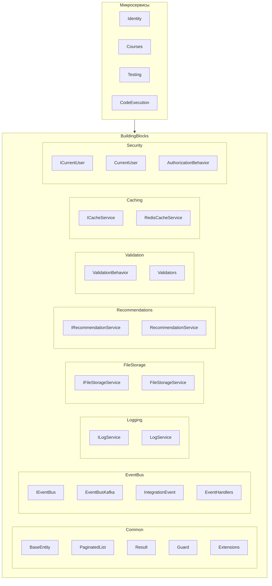
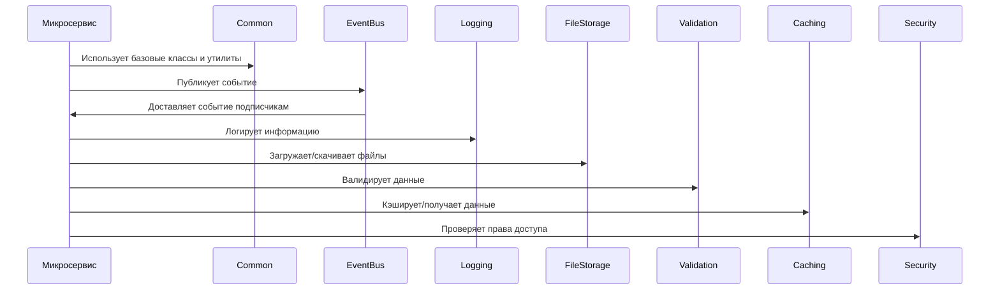

# Общие компоненты (BuildingBlocks) системы AiTestPlatform

В этом документе описаны общие компоненты (BuildingBlocks), используемые всеми микросервисами в системе AiTestPlatform.

## Диаграмма компонентов



## Описание компонентов

### Common

Общие базовые классы и утилиты, используемые во всех микросервисах.

#### BaseEntity

Базовый класс для всех сущностей в системе.

```csharp
public abstract class BaseEntity
{
    public Guid Id { get; protected set; }
    public DateTime CreatedAt { get; protected set; }
    public DateTime? UpdatedAt { get; protected set; }
    
    protected BaseEntity()
    {
        Id = Guid.NewGuid();
        CreatedAt = DateTime.UtcNow;
    }
}
```

#### PaginatedList

Класс для представления пагинированных списков данных.

```csharp
public class PaginatedList<T>
{
    public List<T> Items { get; }
    public int PageIndex { get; }
    public int TotalPages { get; }
    public int TotalCount { get; }
    
    public PaginatedList(List<T> items, int count, int pageIndex, int pageSize)
    {
        PageIndex = pageIndex;
        TotalPages = (int)Math.Ceiling(count / (double)pageSize);
        TotalCount = count;
        Items = items;
    }
    
    public bool HasPreviousPage => PageIndex > 1;
    public bool HasNextPage => PageIndex < TotalPages;
}
```

#### Result

Класс для представления результатов операций.

```csharp
public class Result
{
    public bool IsSuccess { get; }
    public string Error { get; }
    public bool IsFailure => !IsSuccess;
    
    protected Result(bool isSuccess, string error)
    {
        IsSuccess = isSuccess;
        Error = error;
    }
    
    public static Result Success() => new Result(true, string.Empty);
    public static Result Failure(string error) => new Result(false, error);
    
    public static Result<T> Success<T>(T value) => new Result<T>(value, true, string.Empty);
    public static Result<T> Failure<T>(string error) => new Result<T>(default, false, error);
}

public class Result<T> : Result
{
    public T Value { get; }
    
    protected internal Result(T value, bool isSuccess, string error) 
        : base(isSuccess, error)
    {
        Value = value;
    }
}
```

### EventBus

Компоненты для реализации шаблона Event Bus для асинхронного взаимодействия между микросервисами.

#### IEventBus

Интерфейс для публикации и подписки на события.

```csharp
public interface IEventBus
{
    Task PublishAsync<T>(T @event) where T : IntegrationEvent;
    void Subscribe<T, TH>() where T : IntegrationEvent where TH : IIntegrationEventHandler<T>;
    void Unsubscribe<T, TH>() where T : IntegrationEvent where TH : IIntegrationEventHandler<T>;
}
```

#### IntegrationEvent

Базовый класс для всех событий интеграции.

```csharp
public abstract class IntegrationEvent
{
    public Guid Id { get; }
    public DateTime CreationDate { get; }
    
    protected IntegrationEvent()
    {
        Id = Guid.NewGuid();
        CreationDate = DateTime.UtcNow;
    }
}
```

### Logging

Компоненты для централизованного логирования.

#### ILogService

Интерфейс для сервиса логирования.

```csharp
public interface ILogService
{
    void LogInformation(string message, params object[] args);
    void LogWarning(string message, params object[] args);
    void LogError(Exception exception, string message, params object[] args);
    void LogDebug(string message, params object[] args);
}
```

### FileStorage

Компоненты для работы с файловым хранилищем.

#### IFileStorageService

Интерфейс для сервиса файлового хранилища.

```csharp
public interface IFileStorageService
{
    Task<string> UploadFileAsync(Stream fileStream, string fileName, string contentType);
    Task<Stream> DownloadFileAsync(string fileUrl);
    Task DeleteFileAsync(string fileUrl);
    Task<bool> FileExistsAsync(string fileUrl);
}
```

### Recommendations

Компоненты для системы рекомендаций.

#### IRecommendationService

Интерфейс для сервиса рекомендаций.

```csharp
public interface IRecommendationService
{
    Task<List<CourseDto>> GetPersonalizedRecommendationsAsync(Guid userId, int count);
    Task<List<CourseDto>> GetSimilarCoursesAsync(Guid courseId, int count);
    Task<List<CourseDto>> GetPopularCoursesAsync(int count);
    Task<List<CourseDto>> GetNewCoursesAsync(int count);
    Task TrackCourseViewAsync(Guid userId, Guid courseId);
    Task UpdateUserInterestsAsync(Guid userId, List<string> interests);
}
```

### Validation

Компоненты для валидации данных.

#### ValidationBehavior

Поведение для валидации запросов в MediatR.

```csharp
public class ValidationBehavior<TRequest, TResponse> : IPipelineBehavior<TRequest, TResponse>
    where TRequest : IRequest<TResponse>
{
    private readonly IEnumerable<IValidator<TRequest>> _validators;
    
    public ValidationBehavior(IEnumerable<IValidator<TRequest>> validators)
    {
        _validators = validators;
    }
    
    public async Task<TResponse> Handle(TRequest request, RequestHandlerDelegate<TResponse> next, CancellationToken cancellationToken)
    {
        if (_validators.Any())
        {
            var context = new ValidationContext<TRequest>(request);
            var validationResults = await Task.WhenAll(_validators.Select(v => v.ValidateAsync(context, cancellationToken)));
            var failures = validationResults.SelectMany(r => r.Errors).Where(f => f != null).ToList();
            
            if (failures.Count != 0)
                throw new ValidationException(failures);
        }
        
        return await next();
    }
}
```

### Caching

Компоненты для кэширования данных.

#### ICacheService

Интерфейс для сервиса кэширования.

```csharp
public interface ICacheService
{
    Task<T> GetOrCreateAsync<T>(string key, Func<Task<T>> factory, TimeSpan? expiration = null);
    Task<T> GetAsync<T>(string key);
    Task SetAsync<T>(string key, T value, TimeSpan? expiration = null);
    Task RemoveAsync(string key);
    Task<bool> ExistsAsync(string key);
}
```

### Security

Компоненты для безопасности и авторизации.

#### ICurrentUser

Интерфейс для доступа к информации о текущем пользователе.

```csharp
public interface ICurrentUser
{
    Guid? Id { get; }
    string UserName { get; }
    string Email { get; }
    bool IsAuthenticated { get; }
    IEnumerable<string> Roles { get; }
    bool IsInRole(string role);
    IEnumerable<Claim> Claims { get; }
    Claim FindClaim(string claimType);
}
```

## Взаимодействие компонентов



## Использование в микросервисах

Все микросервисы (Identity, Courses, Testing, CodeExecution) используют общие компоненты из BuildingBlocks для обеспечения единообразия и повторного использования кода.

Пример использования в микросервисе Courses:

```csharp
public class CreateCourseCommandHandler : IRequestHandler<CreateCourseCommand, Result<Guid>>
{
    private readonly ICoursesRepository _repository;
    private readonly IEventBus _eventBus;
    private readonly ILogService _logService;
    private readonly ICurrentUser _currentUser;
    
    public CreateCourseCommandHandler(
        ICoursesRepository repository,
        IEventBus eventBus,
        ILogService logService,
        ICurrentUser currentUser)
    {
        _repository = repository;
        _eventBus = eventBus;
        _logService = logService;
        _currentUser = currentUser;
    }
    
    public async Task<Result<Guid>> Handle(CreateCourseCommand request, CancellationToken cancellationToken)
    {
        try
        {
            var course = new Course
            {
                Title = request.Title,
                Description = request.Description,
                AuthorId = _currentUser.Id.Value
                // Другие свойства
            };
            
            await _repository.AddAsync(course, cancellationToken);
            
            var @event = new CourseCreatedEvent
            {
                CourseId = course.Id,
                Title = course.Title,
                AuthorId = course.AuthorId
            };
            
            await _eventBus.PublishAsync(@event);
            
            _logService.LogInformation("Course {CourseId} created by {UserId}", course.Id, _currentUser.Id);
            
            return Result.Success(course.Id);
        }
        catch (Exception ex)
        {
            _logService.LogError(ex, "Error creating course");
            return Result.Failure<Guid>("Failed to create course: " + ex.Message);
        }
    }
}
```

## Конфигурация в Startup

Пример регистрации общих компонентов в Startup.cs микросервиса:

```csharp
public void ConfigureServices(IServiceCollection services)
{
    // Регистрация общих компонентов
    services.AddScoped<ILogService, LogService>();
    services.AddScoped<IFileStorageService, FileStorageService>();
    services.AddScoped<ICacheService, RedisCacheService>();
    services.AddScoped<ICurrentUser, CurrentUser>();
    
    // Регистрация EventBus
    services.AddSingleton<IEventBus, EventBusKafka>(sp =>
    {
        var kafkaConnection = Configuration["EventBusConnection"];
        var kafkaGroupId = Configuration["EventBusGroupId"];
        var logService = sp.GetRequiredService<ILogService>();
        var serviceProvider = sp.GetRequiredService<IServiceProvider>();
        
        return new EventBusKafka(kafkaConnection, kafkaGroupId, logService, serviceProvider);
    });
    
    // Регистрация валидации
    services.AddTransient(typeof(IPipelineBehavior<,>), typeof(ValidationBehavior<,>));
    services.AddValidatorsFromAssembly(Assembly.GetExecutingAssembly());
    
    // Регистрация авторизации
    services.AddTransient(typeof(IPipelineBehavior<,>), typeof(AuthorizationBehavior<,>));
}
```