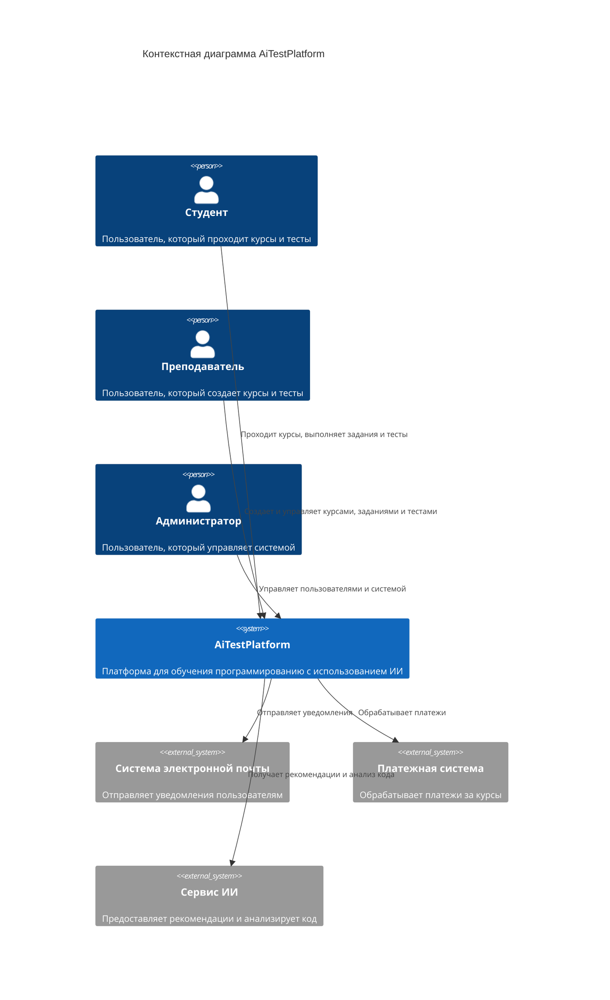
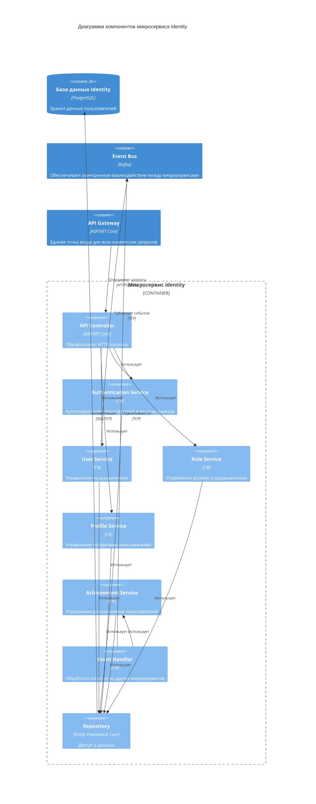
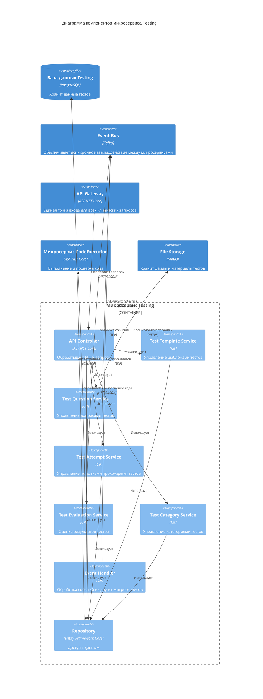
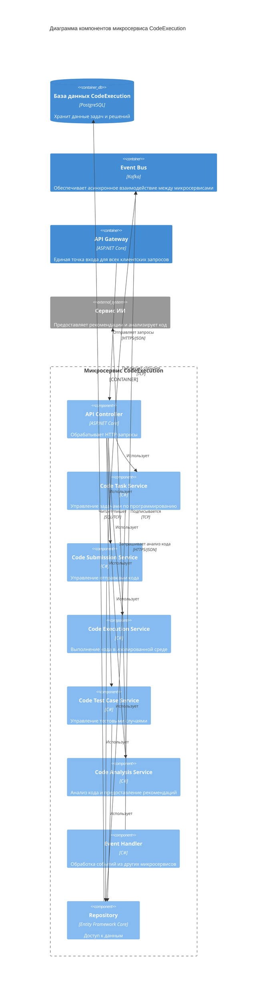
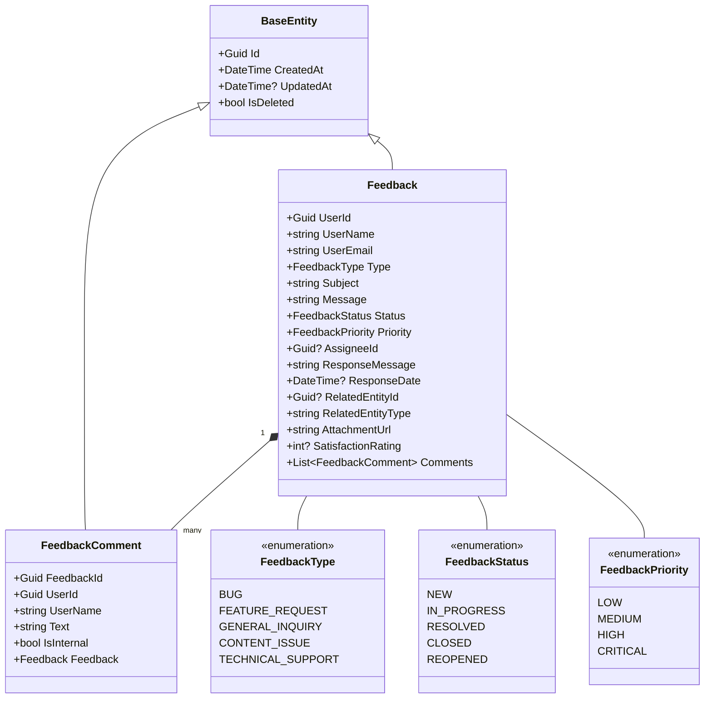

# Диаграммы C4 для AiTestPlatform

В этом документе представлены диаграммы C4 для визуализации архитектуры проекта AiTestPlatform.

## Содержание

1. [Контекстная диаграмма (C1)](#контекстная-диаграмма-c1)
2. [Диаграмма контейнеров (C2)](#диаграмма-контейнеров-c2)
3. [Диаграмма компонентов (C3)](#диаграмма-компонентов-c3)
   - [Микросервис Identity](#микросервис-identity)
   - [Микросервис Courses](#микросервис-courses)
   - [Микросервис Testing](#микросервис-testing)
   - [Микросервис CodeExecution](#микросервис-codeexecution)

## Контекстная диаграмма (C1)

## Диаграмма контейнеров (C2)

```mermaid
C4Container
    title Диаграмма контейнеров AiTestPlatform
    
    Person(student, "Студент", "Пользователь, который проходит курсы и тесты")
    Person(teacher, "Преподаватель", "Пользователь, который создает курсы и тесты")
    Person(admin, "Администратор", "Пользователь, который управляет системой")
    
    System_Boundary(aiTestPlatform, "AiTestPlatform") {
        Container(webApp, "Web-приложение", "React, TypeScript", "Предоставляет пользовательский интерфейс для взаимодействия с системой")
        Container(mobileApp, "Мобильное приложение", "React Native", "Мобильный интерфейс для студентов")
        
        Container(apiGateway, "API Gateway", "ASP.NET Core", "Единая точка входа для всех клиентских запросов")
        
        Container(identityService, "Микросервис Identity", "ASP.NET Core", "Управление пользователями, аутентификация и авторизация")
        Container(coursesService, "Микросервис Courses", "ASP.NET Core", "Управление курсами, модулями и уроками")
        Container(testingService, "Микросервис Testing", "ASP.NET Core", "Управление тестами и оценками")
        Container(codeExecService, "Микросервис CodeExecution", "ASP.NET Core", "Выполнение и проверка кода")
        
        ContainerDb(identityDb, "База данных Identity", "PostgreSQL", "Хранит данные пользователей")
        ContainerDb(coursesDb, "База данных Courses", "PostgreSQL", "Хранит данные курсов")
        ContainerDb(testingDb, "База данных Testing", "PostgreSQL", "Хранит данные тестов")
        ContainerDb(codeExecDb, "База данных CodeExecution", "PostgreSQL", "Хранит данные задач и решений")
        
        Container(eventBus, "Event Bus", "Kafka", "Обеспечивает асинхронное взаимодействие между микросервисами")
        Container(fileStorage, "File Storage", "MinIO", "Хранит файлы и материалы курсов")
    }
    
    System_Ext(emailSystem, "Система электронной почты", "Отправляет уведомления пользователям")
    System_Ext(paymentSystem, "Платежная система", "Обрабатывает платежи за курсы")
    System_Ext(aiService, "Сервис ИИ", "Предоставляет рекомендации и анализирует код")
    
    Rel(student, webApp, "Использует", "HTTPS")
    Rel(student, mobileApp, "Использует", "HTTPS")
    Rel(teacher, webApp, "Использует", "HTTPS")
    Rel(admin, webApp, "Использует", "HTTPS")
    
    Rel(webApp, apiGateway, "Отправляет запросы", "HTTPS/JSON")
    Rel(mobileApp, apiGateway, "Отправляет запросы", "HTTPS/JSON")
    
    Rel(apiGateway, identityService, "Перенаправляет запросы", "HTTPS/JSON")
    Rel(apiGateway, coursesService, "Перенаправляет запросы", "HTTPS/JSON")
    Rel(apiGateway, testingService, "Перенаправляет запросы", "HTTPS/JSON")
    Rel(apiGateway, codeExecService, "Перенаправляет запросы", "HTTPS/JSON")
    
    Rel(identityService, identityDb, "Читает/пишет", "SQL/TCP")
    Rel(coursesService, coursesDb, "Читает/пишет", "SQL/TCP")
    Rel(testingService, testingDb, "Читает/пишет", "SQL/TCP")
    Rel(codeExecService, codeExecDb, "Читает/пишет", "SQL/TCP")
    
    Rel(identityService, eventBus, "Публикует/подписывается", "TCP")
    Rel(coursesService, eventBus, "Публикует/подписывается", "TCP")
    Rel(testingService, eventBus, "Публикует/подписывается", "TCP")
    Rel(codeExecService, eventBus, "Публикует/подписывается", "TCP")
    
    Rel(coursesService, fileStorage, "Хранит/получает файлы", "HTTPS")
    Rel(testingService, fileStorage, "Хранит/получает файлы", "HTTPS")
    
    Rel(identityService, emailSystem, "Отправляет уведомления", "SMTP")
    Rel(coursesService, paymentSystem, "Обрабатывает платежи", "HTTPS/JSON")
    Rel(codeExecService, aiService, "Получает рекомендации", "HTTPS/JSON")
```

## Диаграмма компонентов (C3)

### Микросервис Identity

### Микросервис Courses

```mermaid
C4Component
    title Диаграмма компонентов микросервиса Courses
    
    Container_Boundary(coursesService, "Микросервис Courses") {
        Component(coursesApi, "API Controller", "ASP.NET Core", "Обрабатывает HTTP-запросы")
        Component(courseService, "Course Service", "C#", "Управление курсами")
        Component(moduleService, "Module Service", "C#", "Управление модулями")
        Component(lessonService, "Lesson Service", "C#", "Управление уроками")
        Component(enrollmentService, "Enrollment Service", "C#", "Управление записями на курсы")
        Component(progressService, "Progress Service", "C#", "Отслеживание прогресса студентов")
        Component(feedbackService, "Feedback Service", "C#", "Управление отзывами")
        Component(notificationService, "Notification Service", "C#", "Управление уведомлениями")
        Component(surveyService, "Survey Service", "C#", "Управление опросами")
        Component(certificateService, "Certificate Service", "C#", "Управление сертификатами")
        Component(coursesEventHandler, "Event Handler", "C#", "Обработка событий из других микросервисов")
        Component(coursesRepository, "Repository", "Entity Framework Core", "Доступ к данным")
    }
    
    ContainerDb(coursesDb, "База данных Courses", "PostgreSQL", "Хранит данные курсов")
    Container(eventBus, "Event Bus", "Kafka", "Обеспечивает асинхронное взаимодействие между микросервисами")
    Container(apiGateway, "API Gateway", "ASP.NET Core", "Единая точка входа для всех клиентских запросов")
    Container(fileStorage, "File Storage", "MinIO", "Хранит файлы и материалы курсов")
    
    Rel(apiGateway, coursesApi, "Отправляет запросы", "HTTPS/JSON")
    
    Rel(coursesApi, courseService, "Использует")
    Rel(coursesApi, moduleService, "Использует")
    Rel(coursesApi, lessonService, "Использует")
    Rel(coursesApi, enrollmentService, "Использует")
    Rel(coursesApi, progressService, "Использует")
    Rel(coursesApi, feedbackService, "Использует")
    Rel(coursesApi, notificationService, "Использует")
    Rel(coursesApi, surveyService, "Использует")
    Rel(coursesApi, certificateService, "Использует")
    
    Rel(courseService, coursesRepository, "Использует")
    Rel(moduleService, coursesRepository, "Использует")
    Rel(lessonService, coursesRepository, "Использует")
    Rel(enrollmentService, coursesRepository, "Использует")
    Rel(progressService, coursesRepository, "Использует")
    Rel(feedbackService, coursesRepository, "Использует")
    Rel(notificationService, coursesRepository, "Использует")
    Rel(surveyService, coursesRepository, "Использует")
    Rel(certificateService, coursesRepository, "Использует")
    
    Rel(coursesRepository, coursesDb, "Читает/пишет", "SQL/TCP")
    
    Rel(lessonService, fileStorage, "Хранит/получает файлы", "HTTPS")
    Rel(certificateService, fileStorage, "Хранит/получает файлы", "HTTPS")
    
    Rel(coursesEventHandler, eventBus, "Подписывается", "TCP")
    Rel(courseService, eventBus, "Публикует события", "TCP")
    Rel(enrollmentService, eventBus, "Публикует события", "TCP")
    Rel(progressService, eventBus, "Публикует события", "TCP")
    Rel(certificateService, eventBus, "Публикует события", "TCP")
    
    Rel(coursesEventHandler, progressService, "Использует")
    Rel(coursesEventHandler, enrollmentService, "Использует")
```

### Микросервис Testing

### Микросервис CodeExecution

## Диаграмма кода (C4)

Пример диаграммы кода для класса `Feedback` в микросервисе Courses:

## Заключение

Диаграммы C4 предоставляют четкое представление об архитектуре системы AiTestPlatform на разных уровнях абстракции:

1. **Контекстная диаграмма (C1)** показывает систему в целом и ее взаимодействие с внешними системами и пользователями.
2. **Диаграмма контейнеров (C2)** детализирует систему до уровня контейнеров (микросервисов, баз данных, клиентских приложений).
3. **Диаграмма компонентов (C3)** показывает внутреннюю структуру каждого микросервиса.
4. **Диаграмма кода (C4)** представляет структуру классов и их взаимосвязи.

Эти диаграммы помогают разработчикам и заинтересованным сторонам понять архитектуру системы и принципы ее работы.