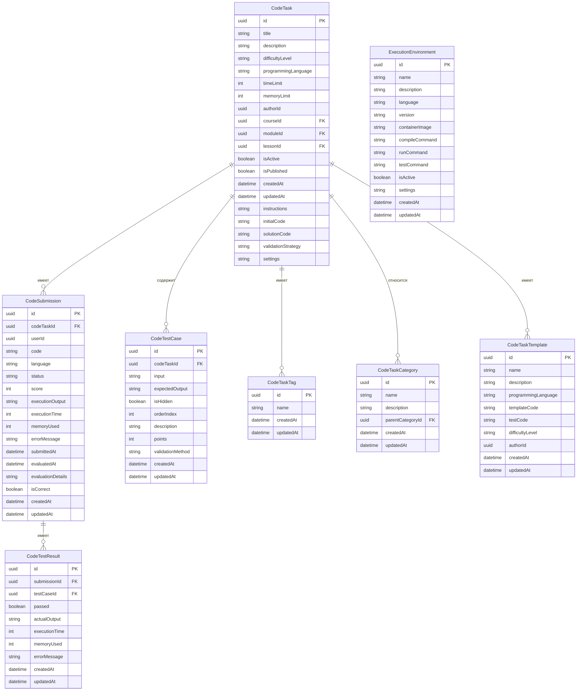

# Схема базы данных микросервиса CodeExecution

В этом документе описана структура базы данных для микросервиса CodeExecution в системе AiTestPlatform.

## ER-диаграмма



## Описание таблиц

### CodeTask
Содержит задания по программированию.

| Поле | Тип | Описание |
|------|-----|----------|
| id | uuid | Первичный ключ |
| title | string | Название задания |
| description | string | Описание задания |
| difficultyLevel | string | Уровень сложности (Easy, Medium, Hard) |
| programmingLanguage | string | Язык программирования |
| timeLimit | int | Ограничение времени выполнения в миллисекундах |
| memoryLimit | int | Ограничение памяти в мегабайтах |
| authorId | uuid | ID автора задания |
| courseId | uuid | ID курса (может быть null) |
| moduleId | uuid | ID модуля (может быть null) |
| lessonId | uuid | ID урока (может быть null) |
| isActive | boolean | Активно ли задание |
| isPublished | boolean | Опубликовано ли задание |
| createdAt | datetime | Дата создания |
| updatedAt | datetime | Дата обновления |
| instructions | string | Инструкции для выполнения задания |
| initialCode | string | Начальный код для студента |
| solutionCode | string | Код решения (для преподавателя) |
| validationStrategy | string | Стратегия валидации (TestCases, UnitTests, OutputComparison) |
| settings | string | JSON с настройками задания |

### CodeSubmission
Содержит отправленные решения заданий.

| Поле | Тип | Описание |
|------|-----|----------|
| id | uuid | Первичный ключ |
| codeTaskId | uuid | ID задания |
| userId | uuid | ID пользователя |
| code | string | Отправленный код |
| language | string | Язык программирования |
| status | string | Статус (Pending, Running, Completed, Failed, TimeLimitExceeded, MemoryLimitExceeded) |
| score | int | Набранные баллы |
| executionOutput | string | Вывод выполнения |
| executionTime | int | Время выполнения в миллисекундах |
| memoryUsed | int | Использованная память в мегабайтах |
| errorMessage | string | Сообщение об ошибке (если есть) |
| submittedAt | datetime | Время отправки |
| evaluatedAt | datetime | Время оценки |
| evaluationDetails | string | JSON с деталями оценки |
| isCorrect | boolean | Правильное ли решение |
| createdAt | datetime | Дата создания |
| updatedAt | datetime | Дата обновления |

### CodeTestCase
Содержит тестовые случаи для заданий.

| Поле | Тип | Описание |
|------|-----|----------|
| id | uuid | Первичный ключ |
| codeTaskId | uuid | ID задания |
| input | string | Входные данные |
| expectedOutput | string | Ожидаемый вывод |
| isHidden | boolean | Скрытый ли тест от студентов |
| orderIndex | int | Порядковый номер теста |
| description | string | Описание теста |
| points | int | Количество баллов за тест |
| validationMethod | string | Метод валидации (ExactMatch, IgnoreWhitespace, Regex, Custom) |
| createdAt | datetime | Дата создания |
| updatedAt | datetime | Дата обновления |

### CodeTestResult
Содержит результаты выполнения тестовых случаев.

| Поле | Тип | Описание |
|------|-----|----------|
| id | uuid | Первичный ключ |
| submissionId | uuid | ID отправленного решения |
| testCaseId | uuid | ID тестового случая |
| passed | boolean | Пройден ли тест |
| actualOutput | string | Фактический вывод |
| executionTime | int | Время выполнения в миллисекундах |
| memoryUsed | int | Использованная память в мегабайтах |
| errorMessage | string | Сообщение об ошибке (если есть) |
| createdAt | datetime | Дата создания |
| updatedAt | datetime | Дата обновления |

### CodeTaskTag
Содержит теги для маркировки заданий.

| Поле | Тип | Описание |
|------|-----|----------|
| id | uuid | Первичный ключ |
| name | string | Название тега |
| createdAt | datetime | Дата создания |
| updatedAt | datetime | Дата обновления |

### CodeTaskCategory
Содержит категории заданий для их классификации.

| Поле | Тип | Описание |
|------|-----|----------|
| id | uuid | Первичный ключ |
| name | string | Название категории |
| description | string | Описание категории |
| parentCategoryId | uuid | ID родительской категории (для иерархии) |
| createdAt | datetime | Дата создания |
| updatedAt | datetime | Дата обновления |

### CodeTaskTemplate
Содержит шаблоны заданий для быстрого создания новых.

| Поле | Тип | Описание |
|------|-----|----------|
| id | uuid | Первичный ключ |
| name | string | Название шаблона |
| description | string | Описание шаблона |
| programmingLanguage | string | Язык программирования |
| templateCode | string | Шаблонный код |
| testCode | string | Код для тестирования |
| difficultyLevel | string | Уровень сложности |
| authorId | uuid | ID автора шаблона |
| createdAt | datetime | Дата создания |
| updatedAt | datetime | Дата обновления |

### ExecutionEnvironment
Содержит информацию о средах выполнения кода.

| Поле | Тип | Описание |
|------|-----|----------|
| id | uuid | Первичный ключ |
| name | string | Название среды |
| description | string | Описание среды |
| language | string | Язык программирования |
| version | string | Версия языка/среды |
| containerImage | string | Docker-образ для выполнения |
| compileCommand | string | Команда для компиляции |
| runCommand | string | Команда для запуска |
| testCommand | string | Команда для тестирования |
| isActive | boolean | Активна ли среда |
| settings | string | JSON с настройками среды |
| createdAt | datetime | Дата создания |
| updatedAt | datetime | Дата обновления |

## Индексы

- CodeTask: индексы по courseId, moduleId, lessonId, authorId, programmingLanguage
- CodeSubmission: индексы по codeTaskId, userId, status
- CodeTestCase: индекс по codeTaskId
- CodeTestResult: индексы по submissionId, testCaseId
- CodeTaskCategory: индекс по parentCategoryId
- ExecutionEnvironment: индексы по language, version

## Миграции Entity Framework Core

Для создания и обновления базы данных используйте следующие команды Entity Framework Core:

```bash
# Создание миграции
dotnet ef migrations add InitialCodeExecutionSchema --project src/Services/CodeExecution/CodeExecution.Infrastructure --startup-project src/Services/CodeExecution/CodeExecution.API

# Применение миграции
dotnet ef database update --project src/Services/CodeExecution/CodeExecution.Infrastructure --startup-project src/Services/CodeExecution/CodeExecution.API
```