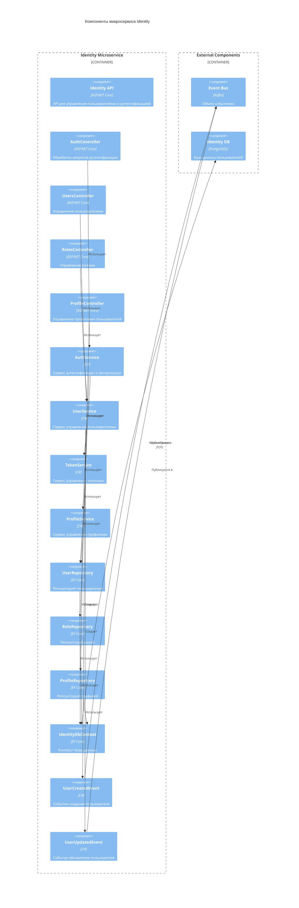

# Диаграммы компонентов AiTestPlatform

В этом документе представлены диаграммы компонентов (Component Diagrams) для визуализации структуры системы AiTestPlatform и взаимодействия между ее компонентами.

## Содержание

1. [Общая архитектура системы](#общая-архитектура-системы)
2. [Микросервис Identity](#микросервис-identity)
3. [Микросервис Courses](#микросервис-courses)
4. [Микросервис Testing](#микросервис-testing)
5. [Микросервис CodeExecution](#микросервис-codeexecution)
6. [Общие компоненты (BuildingBlocks)](#общие-компоненты-buildingblocks)
7. [Клиентское приложение](#клиентское-приложение)

## Общая архитектура системы

```mermaid
C4Component
    title Общая архитектура системы AiTestPlatform

    Container_Boundary(api_gateway, "API Gateway") {
        Component(gateway, "API Gateway", "Ocelot", "Маршрутизация запросов к микросервисам")
    }

    Container_Boundary(identity, "Identity Microservice") {
        Component(identity_api, "Identity API", "ASP.NET Core", "API для управления пользователями и аутентификацией")
        Component(identity_domain, "Identity Domain", "C#", "Бизнес-логика управления пользователями")
        Component(identity_data, "Identity Data", "EF Core", "Доступ к данным пользователей")
    }

    Container_Boundary(courses, "Courses Microservice") {
        Component(courses_api, "Courses API", "ASP.NET Core", "API для управления курсами")
        Component(courses_domain, "Courses Domain", "C#", "Бизнес-логика управления курсами")
        Component(courses_data, "Courses Data", "EF Core", "Доступ к данным курсов")
    }

    Container_Boundary(testing, "Testing Microservice") {
        Component(testing_api, "Testing API", "ASP.NET Core", "API для управления тестами")
        Component(testing_domain, "Testing Domain", "C#", "Бизнес-логика управления тестами")
        Component(testing_data, "Testing Data", "EF Core", "Доступ к данным тестов")
    }

    Container_Boundary(code_execution, "CodeExecution Microservice") {
        Component(code_api, "CodeExecution API", "ASP.NET Core", "API для выполнения кода")
        Component(code_domain, "CodeExecution Domain", "C#", "Бизнес-логика выполнения кода")
        Component(code_data, "CodeExecution Data", "EF Core", "Доступ к данным заданий")
        Component(code_runner, "Code Runner", "Docker", "Изолированное выполнение кода")
    }

    Container_Boundary(building_blocks, "Building Blocks") {
        Component(common, "Common", "C#", "Общие модели и утилиты")
        Component(event_bus, "Event Bus", "Kafka", "Обмен событиями между микросервисами")
    }

    Container_Boundary(frontend, "Frontend") {
        Component(web_app, "Web Application", "React", "Пользовательский интерфейс")
    }

    Container_Boundary(storage, "Storage") {
        Component(identity_db, "Identity DB", "PostgreSQL", "База данных пользователей")
        Component(courses_db, "Courses DB", "PostgreSQL", "База данных курсов")
        Component(testing_db, "Testing DB", "PostgreSQL", "База данных тестов")
        Component(code_db, "CodeExecution DB", "PostgreSQL", "База данных заданий")
        Component(file_storage, "File Storage", "MinIO", "Хранилище файлов")
    }

    Rel(web_app, gateway, "Использует", "HTTPS")
    
    Rel(gateway, identity_api, "Маршрутизирует запросы", "HTTPS")
    Rel(gateway, courses_api, "Маршрутизирует запросы", "HTTPS")
    Rel(gateway, testing_api, "Маршрутизирует запросы", "HTTPS")
    Rel(gateway, code_api, "Маршрутизирует запросы", "HTTPS")
    
    Rel(identity_api, identity_domain, "Использует")
    Rel(identity_domain, identity_data, "Использует")
    Rel(identity_data, identity_db, "Читает/Пишет", "TCP")
    
    Rel(courses_api, courses_domain, "Использует")
    Rel(courses_domain, courses_data, "Использует")
    Rel(courses_data, courses_db, "Читает/Пишет", "TCP")
    
    Rel(testing_api, testing_domain, "Использует")
    Rel(testing_domain, testing_data, "Использует")
    Rel(testing_data, testing_db, "Читает/Пишет", "TCP")
    
    Rel(code_api, code_domain, "Использует")
    Rel(code_domain, code_data, "Использует")
    Rel(code_data, code_db, "Читает/Пишет", "TCP")
    Rel(code_domain, code_runner, "Запускает", "Docker API")
    
    Rel(identity_domain, event_bus, "Публикует события")
    Rel(courses_domain, event_bus, "Публикует/Подписывается на события")
    Rel(testing_domain, event_bus, "Публикует/Подписывается на события")
    Rel(code_domain, event_bus, "Публикует/Подписывается на события")
    
    Rel(identity_domain, common, "Использует")
    Rel(courses_domain, common, "Использует")
    Rel(testing_domain, common, "Использует")
    Rel(code_domain, common, "Использует")
    
    Rel(courses_domain, file_storage, "Сохраняет/Получает файлы", "S3 API")
    Rel(testing_domain, file_storage, "Сохраняет/Получает файлы", "S3 API")
    Rel(code_domain, file_storage, "Сохраняет/Получает файлы", "S3 API")
```

## Микросервис Identity

## Микросервис Courses

```mermaid
C4Component
    title Компоненты микросервиса Courses

    Container_Boundary(courses, "Courses Microservice") {
        Component(courses_api, "Courses API", "ASP.NET Core", "API для управления курсами")
        
        Component(courses_controller, "CoursesController", "ASP.NET Core", "Управление курсами")
        Component(modules_controller, "ModulesController", "ASP.NET Core", "Управление модулями")
        Component(lessons_controller, "LessonsController", "ASP.NET Core", "Управление уроками")
        Component(enrollments_controller, "EnrollmentsController", "ASP.NET Core", "Управление зачислениями")
        Component(feedback_controller, "FeedbackController", "ASP.NET Core", "Управление отзывами")
        Component(survey_controller, "SurveyController", "ASP.NET Core", "Управление опросами")
        Component(certificate_controller, "CertificateController", "ASP.NET Core", "Управление сертификатами")
        Component(notification_controller, "NotificationController", "ASP.NET Core", "Управление уведомлениями")
        
        Component(course_service, "CourseService", "C#", "Сервис управления курсами")
        Component(module_service, "ModuleService", "C#", "Сервис управления модулями")
        Component(lesson_service, "LessonService", "C#", "Сервис управления уроками")
        Component(enrollment_service, "EnrollmentService", "C#", "Сервис управления зачислениями")
        Component(feedback_service, "FeedbackService", "C#", "Сервис управления отзывами")
        Component(survey_service, "SurveyService", "C#", "Сервис управления опросами")
        Component(certificate_service, "CertificateService", "C#", "Сервис управления сертификатами")
        Component(notification_service, "NotificationService", "C#", "Сервис управления уведомлениями")
        
        Component(course_repository, "CourseRepository", "EF Core", "Репозиторий курсов")
        Component(module_repository, "ModuleRepository", "EF Core", "Репозиторий модулей")
        Component(lesson_repository, "LessonRepository", "EF Core", "Репозиторий уроков")
        Component(enrollment_repository, "EnrollmentRepository", "EF Core", "Репозиторий зачислений")
        Component(feedback_repository, "FeedbackRepository", "EF Core", "Репозиторий отзывов")
        Component(survey_repository, "SurveyRepository", "EF Core", "Репозиторий опросов")
        Component(certificate_repository, "CertificateRepository", "EF Core", "Репозиторий сертификатов")
        Component(notification_repository, "NotificationRepository", "EF Core", "Репозиторий уведомлений")
        
        Component(courses_context, "CoursesDbContext", "EF Core", "Контекст базы данных")
        
        Component(course_created_event, "CourseCreatedEvent", "C#", "Событие создания курса")
        Component(course_published_event, "CoursePublishedEvent", "C#", "Событие публикации курса")
        Component(enrollment_created_event, "EnrollmentCreatedEvent", "C#", "Событие создания зачисления")
        Component(certificate_issued_event, "CertificateIssuedEvent", "C#", "Событие выдачи сертификата")
        
        Component(user_created_handler, "UserCreatedEventHandler", "C#", "Обработчик события создания пользователя")
        Component(test_completed_handler, "TestCompletedEventHandler", "C#", "Обработчик события завершения теста")
    }

    Container_Boundary(external, "External Components") {
        Component(event_bus, "Event Bus", "Kafka", "Обмен событиями")
        Component(courses_db, "Courses DB", "PostgreSQL", "База данных курсов")
        Component(file_storage, "File Storage", "MinIO", "Хранилище файлов")
    }

    Rel(courses_controller, course_service, "Использует")
    Rel(modules_controller, module_service, "Использует")
    Rel(lessons_controller, lesson_service, "Использует")
    Rel(enrollments_controller, enrollment_service, "Использует")
    Rel(feedback_controller, feedback_service, "Использует")
    Rel(survey_controller, survey_service, "Использует")
    Rel(certificate_controller, certificate_service, "Использует")
    Rel(notification_controller, notification_service, "Использует")
    
    Rel(course_service, course_repository, "Использует")
    Rel(module_service, module_repository, "Использует")
    Rel(lesson_service, lesson_repository, "Использует")
    Rel(enrollment_service, enrollment_repository, "Использует")
    Rel(feedback_service, feedback_repository, "Использует")
    Rel(survey_service, survey_repository, "Использует")
    Rel(certificate_service, certificate_repository, "Использует")
    Rel(notification_service, notification_repository, "Использует")
    
    Rel(course_service, course_created_event, "Создает")
    Rel(course_service, course_published_event, "Создает")
    Rel(enrollment_service, enrollment_created_event, "Создает")
    Rel(certificate_service, certificate_issued_event, "Создает")
    
    Rel(course_repository, courses_context, "Использует")
    Rel(module_repository, courses_context, "Использует")
    Rel(lesson_repository, courses_context, "Использует")
    Rel(enrollment_repository, courses_context, "Использует")
    Rel(feedback_repository, courses_context, "Использует")
    Rel(survey_repository, courses_context, "Использует")
    Rel(certificate_repository, courses_context, "Использует")
    Rel(notification_repository, courses_context, "Использует")
    
    Rel(courses_context, courses_db, "Читает/Пишет", "TCP")
    
    Rel(lesson_service, file_storage, "Сохраняет/Получает файлы", "S3 API")
    Rel(certificate_service, file_storage, "Сохраняет сертификаты", "S3 API")
    
    Rel(course_created_event, event_bus, "Публикуется в")
    Rel(course_published_event, event_bus, "Публикуется в")
    Rel(enrollment_created_event, event_bus, "Публикуется в")
    Rel(certificate_issued_event, event_bus, "Публикуется в")
    
    Rel(event_bus, user_created_handler, "Доставляет события")
    Rel(event_bus, test_completed_handler, "Доставляет события")
```

## Микросервис Testing

```mermaid
C4Component
    title Компоненты микросервиса Testing

    Container_Boundary(testing, "Testing Microservice") {
        Component(testing_api, "Testing API", "ASP.NET Core", "API для управления тестами")
        
        Component(test_templates_controller, "TestTemplatesController", "ASP.NET Core", "Управление шаблонами тестов")
        Component(test_questions_controller, "TestQuestionsController", "ASP.NET Core", "Управление вопросами тестов")
        Component(test_attempts_controller, "TestAttemptsController", "ASP.NET Core", "Управление попытками прохождения тестов")
        Component(test_categories_controller, "TestCategoriesController", "ASP.NET Core", "Управление категориями тестов")
        
        Component(test_template_service, "TestTemplateService", "C#", "Сервис управления шаблонами тестов")
        Component(test_question_service, "TestQuestionService", "C#", "Сервис управления вопросами тестов")
        Component(test_attempt_service, "TestAttemptService", "C#", "Сервис управления попытками прохождения тестов")
        Component(test_category_service, "TestCategoryService", "C#", "Сервис управления категориями тестов")
        Component(test_evaluation_service, "TestEvaluationService", "C#", "Сервис оценки результатов тестов")
        
        Component(test_template_repository, "TestTemplateRepository", "EF Core", "Репозиторий шаблонов тестов")
        Component(test_question_repository, "TestQuestionRepository", "EF Core", "Репозиторий вопросов тестов")
        Component(test_attempt_repository, "TestAttemptRepository", "EF Core", "Репозиторий попыток прохождения тестов")
        Component(test_category_repository, "TestCategoryRepository", "EF Core", "Репозиторий категорий тестов")
        
        Component(testing_context, "TestingDbContext", "EF Core", "Контекст базы данных")
        
        Component(test_created_event, "TestCreatedEvent", "C#", "Событие создания теста")
        Component(test_published_event, "TestPublishedEvent", "C#", "Событие публикации теста")
        Component(test_completed_event, "TestCompletedEvent", "C#", "Событие завершения теста")
        
        Component(course_published_handler, "CoursePublishedEventHandler", "C#", "Обработчик события публикации курса")
        Component(enrollment_created_handler, "EnrollmentCreatedEventHandler", "C#", "Обработчик события создания зачисления")
    }

    Container_Boundary(external, "External Components") {
        Component(event_bus, "Event Bus", "Kafka", "Обмен событиями")
        Component(testing_db, "Testing DB", "PostgreSQL", "База данных тестов")
        Component(file_storage, "File Storage", "MinIO", "Хранилище файлов")
    }

    Rel(test_templates_controller, test_template_service, "Использует")
    Rel(test_questions_controller, test_question_service, "Использует")
    Rel(test_attempts_controller, test_attempt_service, "Использует")
    Rel(test_categories_controller, test_category_service, "Использует")
    
    Rel(test_template_service, test_template_repository, "Использует")
    Rel(test_question_service, test_question_repository, "Использует")
    Rel(test_attempt_service, test_attempt_repository, "Использует")
    Rel(test_category_service, test_category_repository, "Использует")
    Rel(test_attempt_service, test_evaluation_service, "Использует")
    
    Rel(test_template_service, test_created_event, "Создает")
    Rel(test_template_service, test_published_event, "Создает")
    Rel(test_attempt_service, test_completed_event, "Создает")
    
    Rel(test_template_repository, testing_context, "Использует")
    Rel(test_question_repository, testing_context, "Использует")
    Rel(test_attempt_repository, testing_context, "Использует")
    Rel(test_category_repository, testing_context, "Использует")
    
    Rel(testing_context, testing_db, "Читает/Пишет", "TCP")
    
    Rel(test_question_service, file_storage, "Сохраняет/Получает файлы", "S3 API")
    
    Rel(test_created_event, event_bus, "Публикуется в")
    Rel(test_published_event, event_bus, "Публикуется в")
    Rel(test_completed_event, event_bus, "Публикуется в")
    
    Rel(event_bus, course_published_handler, "Доставляет события")
    Rel(event_bus, enrollment_created_handler, "Доставляет события")
```

## Микросервис CodeExecution

```mermaid
C4Component
    title Компоненты микросервиса CodeExecution

    Container_Boundary(code_execution, "CodeExecution Microservice") {
        Component(code_api, "CodeExecution API", "ASP.NET Core", "API для выполнения кода")
        
        Component(code_tasks_controller, "CodeTasksController", "ASP.NET Core", "Управление заданиями по программированию")
        Component(code_submissions_controller, "CodeSubmissionsController", "ASP.NET Core", "Управление отправками кода")
        Component(code_environments_controller, "CodeEnvironmentsController", "ASP.NET Core", "Управление средами выполнения")
        
        Component(code_task_service, "CodeTaskService", "C#", "Сервис управления заданиями")
        Component(code_submission_service, "CodeSubmissionService", "C#", "Сервис управления отправками")
        Component(code_execution_service, "CodeExecutionService", "C#", "Сервис выполнения кода")
        Component(code_environment_service, "CodeEnvironmentService", "C#", "Сервис управления средами выполнения")
        
        Component(code_task_repository, "CodeTaskRepository", "EF Core", "Репозиторий заданий")
        Component(code_submission_repository, "CodeSubmissionRepository", "EF Core", "Репозиторий отправок")
        Component(code_test_case_repository, "CodeTestCaseRepository", "EF Core", "Репозиторий тестовых случаев")
        Component(code_environment_repository, "CodeEnvironmentRepository", "EF Core", "Репозиторий сред выполнения")
        
        Component(code_execution_context, "CodeExecutionDbContext", "EF Core", "Контекст базы данных")
        
        Component(docker_service, "DockerService", "C#", "Сервис для работы с Docker")
        Component(code_runner, "CodeRunner", "Docker", "Изолированное выполнение кода")
        
        Component(code_task_created_event, "CodeTaskCreatedEvent", "C#", "Событие создания задания")
        Component(code_task_published_event, "CodeTaskPublishedEvent", "C#", "Событие публикации задания")
        Component(code_submission_completed_event, "CodeSubmissionCompletedEvent", "C#", "Событие завершения отправки")
        
        Component(course_published_handler, "CoursePublishedEventHandler", "C#", "Обработчик события публикации курса")
        Component(enrollment_created_handler, "EnrollmentCreatedEventHandler", "C#", "Обработчик события создания зачисления")
    }

    Container_Boundary(external, "External Components") {
        Component(event_bus, "Event Bus", "Kafka", "Обмен событиями")
        Component(code_db, "CodeExecution DB", "PostgreSQL", "База данных заданий")
        Component(file_storage, "File Storage", "MinIO", "Хранилище файлов")
    }

    Rel(code_tasks_controller, code_task_service, "Использует")
    Rel(code_submissions_controller, code_submission_service, "Использует")
    Rel(code_environments_controller, code_environment_service, "Использует")
    
    Rel(code_task_service, code_task_repository, "Использует")
    Rel(code_submission_service, code_submission_repository, "Использует")
    Rel(code_submission_service, code_execution_service, "Использует")
    Rel(code_environment_service, code_environment_repository, "Использует")
    
    Rel(code_execution_service, docker_service, "Использует")
    Rel(docker_service, code_runner, "Управляет", "Docker API")
    
    Rel(code_task_service, code_task_created_event, "Создает")
    Rel(code_task_service, code_task_published_event, "Создает")
    Rel(code_submission_service, code_submission_completed_event, "Создает")
    
    Rel(code_task_repository, code_execution_context, "Использует")
    Rel(code_submission_repository, code_execution_context, "Использует")
    Rel(code_test_case_repository, code_execution_context, "Использует")
    Rel(code_environment_repository, code_execution_context, "Использует")
    
    Rel(code_execution_context, code_db, "Читает/Пишет", "TCP")
    
    Rel(code_task_service, file_storage, "Сохраняет/Получает файлы", "S3 API")
    
    Rel(code_task_created_event, event_bus, "Публикуется в")
    Rel(code_task_published_event, event_bus, "Публикуется в")
    Rel(code_submission_completed_event, event_bus, "Публикуется в")
    
    Rel(event_bus, course_published_handler, "Доставляет события")
    Rel(event_bus, enrollment_created_handler, "Доставляет события")
```

## Общие компоненты (BuildingBlocks)

```mermaid
C4Component
    title Общие компоненты (BuildingBlocks)

    Container_Boundary(building_blocks, "Building Blocks") {
        Component(common, "Common", "C#", "Общие модели и утилиты")
        Component(event_bus, "Event Bus", "C#/Kafka", "Обмен событиями между микросервисами")
        Component(logging, "Logging", "C#/Serilog", "Логирование")
        Component(file_storage, "FileStorage", "C#/MinIO", "Работа с файловым хранилищем")
        Component(validation, "Validation", "C#/FluentValidation", "Валидация")
        Component(caching, "Caching", "C#/Redis", "Кэширование")
        Component(security, "Security", "C#/JWT", "Безопасность")
    }

    Container_Boundary(common_components, "Common Components") {
        Component(base_entity, "BaseEntity", "C#", "Базовый класс для всех сущностей")
        Component(paginated_list, "PaginatedList", "C#", "Пагинация результатов")
        Component(result, "Result", "C#", "Обертка для результатов операций")
    }

    Container_Boundary(event_bus_components, "Event Bus Components") {
        Component(event_bus_interface, "IEventBus", "C#", "Интерфейс шины событий")
        Component(integration_event, "IntegrationEvent", "C#", "Базовый класс для событий интеграции")
        Component(event_bus_implementation, "KafkaEventBus", "C#/Kafka", "Реализация шины событий на Kafka")
    }

    Container_Boundary(logging_components, "Logging Components") {
        Component(log_service_interface, "ILogService", "C#", "Интерфейс сервиса логирования")
        Component(log_service_implementation, "SerilogLogService", "C#/Serilog", "Реализация сервиса логирования на Serilog")
    }

    Container_Boundary(file_storage_components, "File Storage Components") {
        Component(file_storage_interface, "IFileStorageService", "C#", "Интерфейс сервиса файлового хранилища")
        Component(file_storage_implementation, "MinIOFileStorageService", "C#/MinIO", "Реализация сервиса файлового хранилища на MinIO")
    }

    Container_Boundary(validation_components, "Validation Components") {
        Component(validation_behavior, "ValidationBehavior", "C#/MediatR/FluentValidation", "Поведение для валидации запросов")
    }

    Container_Boundary(caching_components, "Caching Components") {
        Component(cache_service_interface, "ICacheService", "C#", "Интерфейс сервиса кэширования")
        Component(cache_service_implementation, "RedisCacheService", "C#/Redis", "Реализация сервиса кэширования на Redis")
    }

    Container_Boundary(security_components, "Security Components") {
        Component(current_user_interface, "ICurrentUser", "C#", "Интерфейс текущего пользователя")
        Component(jwt_service, "JwtService", "C#/JWT", "Сервис для работы с JWT-токенами")
    }

    Rel(common, base_entity, "Содержит")
    Rel(common, paginated_list, "Содержит")
    Rel(common, result, "Содержит")
    
    Rel(event_bus, event_bus_interface, "Содержит")
    Rel(event_bus, integration_event, "Содержит")
    Rel(event_bus, event_bus_implementation, "Содержит")
    
    Rel(logging, log_service_interface, "Содержит")
    Rel(logging, log_service_implementation, "Содержит")
    
    Rel(file_storage, file_storage_interface, "Содержит")
    Rel(file_storage, file_storage_implementation, "Содержит")
    
    Rel(validation, validation_behavior, "Содержит")
    
    Rel(caching, cache_service_interface, "Содержит")
    Rel(caching, cache_service_implementation, "Содержит")
    
    Rel(security, current_user_interface, "Содержит")
    Rel(security, jwt_service, "Содержит")
```

## Клиентское приложение

```mermaid
C4Component
    title Компоненты клиентского приложения

    Container_Boundary(frontend, "Frontend") {
        Component(web_app, "Web Application", "React", "Пользовательский интерфейс")
        
        Component(auth_module, "Auth Module", "React/Redux", "Модуль аутентификации")
        Component(courses_module, "Courses Module", "React/Redux", "Модуль курсов")
        Component(testing_module, "Testing Module", "React/Redux", "Модуль тестирования")
        Component(code_execution_module, "CodeExecution Module", "React/Redux", "Модуль выполнения кода")
        Component(profile_module, "Profile Module", "React/Redux", "Модуль профиля")
        Component(admin_module, "Admin Module", "React/Redux", "Модуль администрирования")
        
        Component(auth_pages, "Auth Pages", "React", "Страницы аутентификации")
        Component(courses_pages, "Courses Pages", "React", "Страницы курсов")
        Component(testing_pages, "Testing Pages", "React", "Страницы тестирования")
        Component(code_execution_pages, "CodeExecution Pages", "React", "Страницы выполнения кода")
        Component(profile_pages, "Profile Pages", "React", "Страницы профиля")
        Component(admin_pages, "Admin Pages", "React", "Страницы администрирования")
        
        Component(auth_service, "AuthService", "JavaScript", "Сервис аутентификации")
        Component(courses_service, "CoursesService", "JavaScript", "Сервис курсов")
        Component(testing_service, "TestingService", "JavaScript", "Сервис тестирования")
        Component(code_execution_service, "CodeExecutionService", "JavaScript", "Сервис выполнения кода")
        Component(profile_service, "ProfileService", "JavaScript", "Сервис профиля")
        Component(admin_service, "AdminService", "JavaScript", "Сервис администрирования")
        
        Component(http_client, "HttpClient", "Axios", "HTTP-клиент")
        Component(store, "Store", "Redux", "Хранилище состояния")
        Component(router, "Router", "React Router", "Маршрутизатор")
        Component(ui_components, "UI Components", "React/Material-UI", "UI-компоненты")
        Component(code_editor, "Code Editor", "Monaco Editor", "Редактор кода")
    }

    Container_Boundary(backend, "Backend") {
        Component(api_gateway, "API Gateway", "Ocelot", "API Gateway")
    }

    Rel(auth_module, auth_pages, "Использует")
    Rel(courses_module, courses_pages, "Использует")
    Rel(testing_module, testing_pages, "Использует")
    Rel(code_execution_module, code_execution_pages, "Использует")
    Rel(profile_module, profile_pages, "Использует")
    Rel(admin_module, admin_pages, "Использует")
    
    Rel(auth_module, auth_service, "Использует")
    Rel(courses_module, courses_service, "Использует")
    Rel(testing_module, testing_service, "Использует")
    Rel(code_execution_module, code_execution_service, "Использует")
    Rel(profile_module, profile_service, "Использует")
    Rel(admin_module, admin_service, "Использует")
    
    Rel(auth_service, http_client, "Использует")
    Rel(courses_service, http_client, "Использует")
    Rel(testing_service, http_client, "Использует")
    Rel(code_execution_service, http_client, "Использует")
    Rel(profile_service, http_client, "Использует")
    Rel(admin_service, http_client, "Использует")
    
    Rel(auth_module, store, "Использует")
    Rel(courses_module, store, "Использует")
    Rel(testing_module, store, "Использует")
    Rel(code_execution_module, store, "Использует")
    Rel(profile_module, store, "Использует")
    Rel(admin_module, store, "Использует")
    
    Rel(auth_pages, router, "Использует")
    Rel(courses_pages, router, "Использует")
    Rel(testing_pages, router, "Использует")
    Rel(code_execution_pages, router, "Использует")
    Rel(profile_pages, router, "Использует")
    Rel(admin_pages, router, "Использует")
    
    Rel(auth_pages, ui_components, "Использует")
    Rel(courses_pages, ui_components, "Использует")
    Rel(testing_pages, ui_components, "Использует")
    Rel(code_execution_pages, ui_components, "Использует")
    Rel(profile_pages, ui_components, "Использует")
    Rel(admin_pages, ui_components, "Использует")
    
    Rel(code_execution_pages, code_editor, "Использует")
    
    Rel(http_client, api_gateway, "Отправляет запросы", "HTTPS")
```

## Заключение

Диаграммы компонентов (Component Diagrams) предоставляют детальное представление о структуре системы AiTestPlatform и взаимодействии между ее компонентами. Они помогают понять:

1. Основные компоненты каждого микросервиса и их назначение
2. Взаимосвязи между компонентами внутри микросервисов
3. Взаимодействие между микросервисами через шину событий
4. Структуру общих компонентов (BuildingBlocks) и их использование в микросервисах
5. Архитектуру клиентского приложения и его взаимодействие с бэкендом

Эти диаграммы являются важным инструментом для разработчиков, архитекторов и других участников проекта, позволяя им лучше понять структуру системы и принципы ее работы.