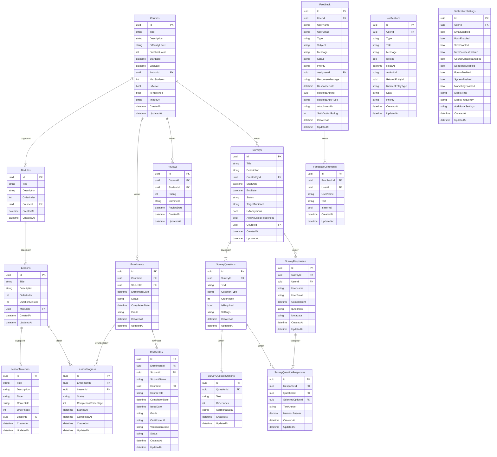

# Схема базы данных микросервиса Courses

## Содержание

1. [Общее описание](#общее-описание)
2. [Схема базы данных](#схема-базы-данных)
3. [Таблицы](#таблицы)
   - [Courses](#courses)
   - [Modules](#modules)
   - [Lessons](#lessons)
   - [LessonMaterials](#lessonmaterials)
   - [Enrollments](#enrollments)
   - [LessonProgress](#lessonprogress)
   - [Reviews](#reviews)
   - [Feedback](#feedback)
   - [FeedbackComments](#feedbackcomments)
   - [Surveys](#surveys)
   - [SurveyQuestions](#surveyquestions)
   - [SurveyQuestionOptions](#surveyquestionoptions)
   - [SurveyResponses](#surveyresponses)
   - [SurveyQuestionResponses](#surveyquestionresponses)
   - [Notifications](#notifications)
   - [NotificationSettings](#notificationsettings)
   - [Certificates](#certificates)
4. [Индексы](#индексы)
5. [Миграции](#миграции)

## Общее описание

База данных микросервиса Courses предназначена для хранения информации о курсах, модулях, уроках, материалах, записях на курсы, прогрессе обучения, отзывах, обратной связи, опросах, уведомлениях и сертификатах.

## Схема базы данных



## Таблицы

### Courses

Таблица для хранения информации о курсах.

| Поле | Тип | Описание |
|------|-----|----------|
| Id | uuid | Первичный ключ |
| Title | string | Название курса |
| Description | string | Описание курса |
| DifficultyLevel | string | Уровень сложности |
| DurationHours | int | Продолжительность в часах |
| StartDate | datetime | Дата начала |
| EndDate | datetime | Дата окончания |
| AuthorId | uuid | Идентификатор автора |
| MaxStudents | int | Максимальное количество студентов |
| IsActive | bool | Активен ли курс |
| IsPublished | bool | Опубликован ли курс |
| ImageUrl | string | URL изображения курса |
| CreatedAt | datetime | Дата создания |
| UpdatedAt | datetime | Дата обновления |

### Modules

Таблица для хранения информации о модулях курсов.

| Поле | Тип | Описание |
|------|-----|----------|
| Id | uuid | Первичный ключ |
| Title | string | Название модуля |
| Description | string | Описание модуля |
| OrderIndex | int | Порядковый номер |
| CourseId | uuid | Идентификатор курса |
| CreatedAt | datetime | Дата создания |
| UpdatedAt | datetime | Дата обновления |

### Lessons

Таблица для хранения информации об уроках.

| Поле | Тип | Описание |
|------|-----|----------|
| Id | uuid | Первичный ключ |
| Title | string | Название урока |
| Description | string | Описание урока |
| OrderIndex | int | Порядковый номер |
| DurationMinutes | int | Продолжительность в минутах |
| ModuleId | uuid | Идентификатор модуля |
| CreatedAt | datetime | Дата создания |
| UpdatedAt | datetime | Дата обновления |

### LessonMaterials

Таблица для хранения информации о материалах уроков.

| Поле | Тип | Описание |
|------|-----|----------|
| Id | uuid | Первичный ключ |
| Title | string | Название материала |
| Description | string | Описание материала |
| Type | string | Тип материала (видео, текст, презентация и т.д.) |
| ContentUrl | string | URL содержимого |
| OrderIndex | int | Порядковый номер |
| LessonId | uuid | Идентификатор урока |
| CreatedAt | datetime | Дата создания |
| UpdatedAt | datetime | Дата обновления |

### Enrollments

Таблица для хранения информации о записях на курсы.

| Поле | Тип | Описание |
|------|-----|----------|
| Id | uuid | Первичный ключ |
| CourseId | uuid | Идентификатор курса |
| StudentId | uuid | Идентификатор студента |
| EnrollmentDate | datetime | Дата записи |
| Status | string | Статус (активный, завершенный, отмененный и т.д.) |
| CompletionDate | datetime | Дата завершения |
| Grade | string | Оценка |
| CreatedAt | datetime | Дата создания |
| UpdatedAt | datetime | Дата обновления |

### LessonProgress

Таблица для хранения информации о прогрессе по урокам.

| Поле | Тип | Описание |
|------|-----|----------|
| Id | uuid | Первичный ключ |
| EnrollmentId | uuid | Идентификатор записи на курс |
| LessonId | uuid | Идентификатор урока |
| Status | string | Статус (не начат, в процессе, завершен и т.д.) |
| CompletionPercentage | int | Процент завершения |
| StartedAt | datetime | Дата начала |
| CompletedAt | datetime | Дата завершения |
| CreatedAt | datetime | Дата создания |
| UpdatedAt | datetime | Дата обновления |

### Reviews

Таблица для хранения информации об отзывах на курсы.

| Поле | Тип | Описание |
|------|-----|----------|
| Id | uuid | Первичный ключ |
| CourseId | uuid | Идентификатор курса |
| StudentId | uuid | Идентификатор студента |
| Rating | int | Оценка (от 1 до 5) |
| Comment | string | Комментарий |
| ReviewDate | datetime | Дата отзыва |
| CreatedAt | datetime | Дата создания |
| UpdatedAt | datetime | Дата обновления |

### Feedback

Таблица для хранения информации об обратной связи.

| Поле | Тип | Описание |
|------|-----|----------|
| Id | uuid | Первичный ключ |
| UserId | uuid | Идентификатор пользователя |
| UserName | string | Имя пользователя |
| UserEmail | string | Email пользователя |
| Type | string | Тип обратной связи (предложение, проблема, вопрос и т.д.) |
| Subject | string | Тема |
| Message | string | Сообщение |
| Status | string | Статус (новый, в обработке, решен и т.д.) |
| Priority | string | Приоритет (низкий, средний, высокий и т.д.) |
| AssigneeId | uuid | Идентификатор назначенного сотрудника |
| ResponseMessage | string | Ответное сообщение |
| ResponseDate | datetime | Дата ответа |
| RelatedEntityId | uuid | Идентификатор связанной сущности |
| RelatedEntityType | string | Тип связанной сущности |
| AttachmentUrl | string | URL вложения |
| SatisfactionRating | int | Оценка удовлетворенности |
| CreatedAt | datetime | Дата создания |
| UpdatedAt | datetime | Дата обновления |

### FeedbackComments

Таблица для хранения информации о комментариях к обратной связи.

| Поле | Тип | Описание |
|------|-----|----------|
| Id | uuid | Первичный ключ |
| FeedbackId | uuid | Идентификатор обратной связи |
| UserId | uuid | Идентификатор пользователя |
| UserName | string | Имя пользователя |
| Text | string | Текст комментария |
| IsInternal | bool | Внутренний ли комментарий |
| CreatedAt | datetime | Дата создания |
| UpdatedAt | datetime | Дата обновления |

### Surveys

Таблица для хранения информации об опросах.

| Поле | Тип | Описание |
|------|-----|----------|
| Id | uuid | Первичный ключ |
| Title | string | Название опроса |
| Description | string | Описание опроса |
| CreatedById | uuid | Идентификатор создателя |
| StartDate | datetime | Дата начала |
| EndDate | datetime | Дата окончания |
| Status | string | Статус (черновик, активный, завершенный и т.д.) |
| TargetAudience | string | Целевая аудитория |
| IsAnonymous | bool | Анонимный ли опрос |
| AllowMultipleResponses | bool | Разрешены ли множественные ответы |
| CourseId | uuid | Идентификатор курса |
| CreatedAt | datetime | Дата создания |
| UpdatedAt | datetime | Дата обновления |

### SurveyQuestions

Таблица для хранения информации о вопросах опросов.

| Поле | Тип | Описание |
|------|-----|----------|
| Id | uuid | Первичный ключ |
| SurveyId | uuid | Идентификатор опроса |
| Text | string | Текст вопроса |
| QuestionType | string | Тип вопроса (выбор, множественный выбор, текст и т.д.) |
| OrderIndex | int | Порядковый номер |
| IsRequired | bool | Обязательный ли вопрос |
| Settings | string | Настройки вопроса (JSON) |
| CreatedAt | datetime | Дата создания |
| UpdatedAt | datetime | Дата обновления |

### SurveyQuestionOptions

Таблица для хранения информации о вариантах ответов на вопросы опросов.

| Поле | Тип | Описание |
|------|-----|----------|
| Id | uuid | Первичный ключ |
| QuestionId | uuid | Идентификатор вопроса |
| Text | string | Текст варианта ответа |
| OrderIndex | int | Порядковый номер |
| AdditionalData | string | Дополнительные данные (JSON) |
| CreatedAt | datetime | Дата создания |
| UpdatedAt | datetime | Дата обновления |

### SurveyResponses

Таблица для хранения информации об ответах на опросы.

| Поле | Тип | Описание |
|------|-----|----------|
| Id | uuid | Первичный ключ |
| SurveyId | uuid | Идентификатор опроса |
| UserId | uuid | Идентификатор пользователя |
| UserName | string | Имя пользователя |
| UserEmail | string | Email пользователя |
| CompletedAt | datetime | Дата завершения |
| IpAddress | string | IP-адрес |
| Metadata | string | Метаданные (JSON) |
| CreatedAt | datetime | Дата создания |
| UpdatedAt | datetime | Дата обновления |

### SurveyQuestionResponses

Таблица для хранения информации об ответах на вопросы опросов.

| Поле | Тип | Описание |
|------|-----|----------|
| Id | uuid | Первичный ключ |
| ResponseId | uuid | Идентификатор ответа на опрос |
| QuestionId | uuid | Идентификатор вопроса |
| SelectedOptionId | uuid | Идентификатор выбранного варианта ответа |
| TextAnswer | string | Текстовый ответ |
| NumericAnswer | decimal | Числовой ответ |
| CreatedAt | datetime | Дата создания |
| UpdatedAt | datetime | Дата обновления |

### Notifications

Таблица для хранения информации об уведомлениях.

| Поле | Тип | Описание |
|------|-----|----------|
| Id | uuid | Первичный ключ |
| UserId | uuid | Идентификатор пользователя |
| Type | string | Тип уведомления |
| Title | string | Заголовок |
| Message | string | Сообщение |
| IsRead | bool | Прочитано ли уведомление |
| ReadAt | datetime | Дата прочтения |
| ActionUrl | string | URL действия |
| RelatedEntityId | uuid | Идентификатор связанной сущности |
| RelatedEntityType | string | Тип связанной сущности |
| Data | string | Дополнительные данные (JSON) |
| Priority | string | Приоритет |
| CreatedAt | datetime | Дата создания |
| UpdatedAt | datetime | Дата обновления |

### NotificationSettings

Таблица для хранения информации о настройках уведомлений.

| Поле | Тип | Описание |
|------|-----|----------|
| Id | uuid | Первичный ключ |
| UserId | uuid | Идентификатор пользователя |
| EmailEnabled | bool | Включены ли email-уведомления |
| PushEnabled | bool | Включены ли push-уведомления |
| SmsEnabled | bool | Включены ли SMS-уведомления |
| NewCoursesEnabled | bool | Включены ли уведомления о новых курсах |
| CourseUpdatesEnabled | bool | Включены ли уведомления об обновлениях курсов |
| DeadlinesEnabled | bool | Включены ли уведомления о дедлайнах |
| ForumEnabled | bool | Включены ли уведомления о форуме |
| SystemEnabled | bool | Включены ли системные уведомления |
| MarketingEnabled | bool | Включены ли маркетинговые уведомления |
| DigestTime | string | Время дайджеста |
| DigestFrequency | string | Частота дайджеста |
| AdditionalSettings | string | Дополнительные настройки (JSON) |
| CreatedAt | datetime | Дата создания |
| UpdatedAt | datetime | Дата обновления |

### Certificates

Таблица для хранения информации о сертификатах.

| Поле | Тип | Описание |
|------|-----|----------|
| Id | uuid | Первичный ключ |
| EnrollmentId | uuid | Идентификатор записи на курс |
| StudentId | uuid | Идентификатор студента |
| StudentName | string | Имя студента |
| CourseId | uuid | Идентификатор курса |
| CourseTitle | string | Название курса |
| CompletionDate | datetime | Дата завершения |
| IssueDate | datetime | Дата выдачи |
| Grade | string | Оценка |
| CertificateUrl | string | URL сертификата |
| VerificationCode | string | Код верификации |
| Status | string | Статус |
| CreatedAt | datetime | Дата создания |
| UpdatedAt | datetime | Дата обновления |

## Индексы

### Courses

- PK_Courses (Id)
- IX_Courses_AuthorId (AuthorId)
- IX_Courses_Title (Title)
- IX_Courses_IsActive_IsPublished (IsActive, IsPublished)

### Modules

- PK_Modules (Id)
- IX_Modules_CourseId (CourseId)
- IX_Modules_OrderIndex (OrderIndex)

### Lessons

- PK_Lessons (Id)
- IX_Lessons_ModuleId (ModuleId)
- IX_Lessons_OrderIndex (OrderIndex)

### LessonMaterials

- PK_LessonMaterials (Id)
- IX_LessonMaterials_LessonId (LessonId)
- IX_LessonMaterials_OrderIndex (OrderIndex)

### Enrollments

- PK_Enrollments (Id)
- IX_Enrollments_CourseId (CourseId)
- IX_Enrollments_StudentId (StudentId)
- IX_Enrollments_Status (Status)

### LessonProgress

- PK_LessonProgress (Id)
- IX_LessonProgress_EnrollmentId (EnrollmentId)
- IX_LessonProgress_LessonId (LessonId)
- IX_LessonProgress_Status (Status)

### Reviews

- PK_Reviews (Id)
- IX_Reviews_CourseId (CourseId)
- IX_Reviews_StudentId (StudentId)
- IX_Reviews_Rating (Rating)

### Feedback

- PK_Feedback (Id)
- IX_Feedback_UserId (UserId)
- IX_Feedback_Status (Status)
- IX_Feedback_Priority (Priority)
- IX_Feedback_AssigneeId (AssigneeId)

### FeedbackComments

- PK_FeedbackComments (Id)
- IX_FeedbackComments_FeedbackId (FeedbackId)
- IX_FeedbackComments_UserId (UserId)

### Surveys

- PK_Surveys (Id)
- IX_Surveys_CreatedById (CreatedById)
- IX_Surveys_Status (Status)
- IX_Surveys_CourseId (CourseId)

### SurveyQuestions

- PK_SurveyQuestions (Id)
- IX_SurveyQuestions_SurveyId (SurveyId)
- IX_SurveyQuestions_OrderIndex (OrderIndex)

### SurveyQuestionOptions

- PK_SurveyQuestionOptions (Id)
- IX_SurveyQuestionOptions_QuestionId (QuestionId)
- IX_SurveyQuestionOptions_OrderIndex (OrderIndex)

### SurveyResponses

- PK_SurveyResponses (Id)
- IX_SurveyResponses_SurveyId (SurveyId)
- IX_SurveyResponses_UserId (UserId)

### SurveyQuestionResponses

- PK_SurveyQuestionResponses (Id)
- IX_SurveyQuestionResponses_ResponseId (ResponseId)
- IX_SurveyQuestionResponses_QuestionId (QuestionId)
- IX_SurveyQuestionResponses_SelectedOptionId (SelectedOptionId)

### Notifications

- PK_Notifications (Id)
- IX_Notifications_UserId (UserId)
- IX_Notifications_IsRead (IsRead)
- IX_Notifications_Type (Type)

### NotificationSettings

- PK_NotificationSettings (Id)
- IX_NotificationSettings_UserId (UserId)

### Certificates

- PK_Certificates (Id)
- IX_Certificates_EnrollmentId (EnrollmentId)
- IX_Certificates_StudentId (StudentId)
- IX_Certificates_CourseId (CourseId)
- IX_Certificates_VerificationCode (VerificationCode)

## Миграции

Для создания и обновления базы данных будут использоваться миграции Entity Framework Core. Миграции будут создаваться с помощью команды:

```bash
dotnet ef migrations add InitialCreate --project Courses.Infrastructure --startup-project Courses.API
```

Применение миграций будет выполняться с помощью команды:

```bash
dotnet ef database update --project Courses.Infrastructure --startup-project Courses.API
```

Или автоматически при запуске приложения с помощью метода `MigrateDatabase` в классе `Program.cs`:

```csharp
public static IHost MigrateDatabase(this IHost host)
{
    using (var scope = host.Services.CreateScope())
    {
        using (var appContext = scope.ServiceProvider.GetRequiredService<CoursesDbContext>())
        {
            try
            {
                appContext.Database.Migrate();
            }
            catch (Exception ex)
            {
                var logger = scope.ServiceProvider.GetRequiredService<ILogger<Program>>();
                logger.LogError(ex, "An error occurred while migrating the database.");
            }
        }
    }
    return host;
}
```