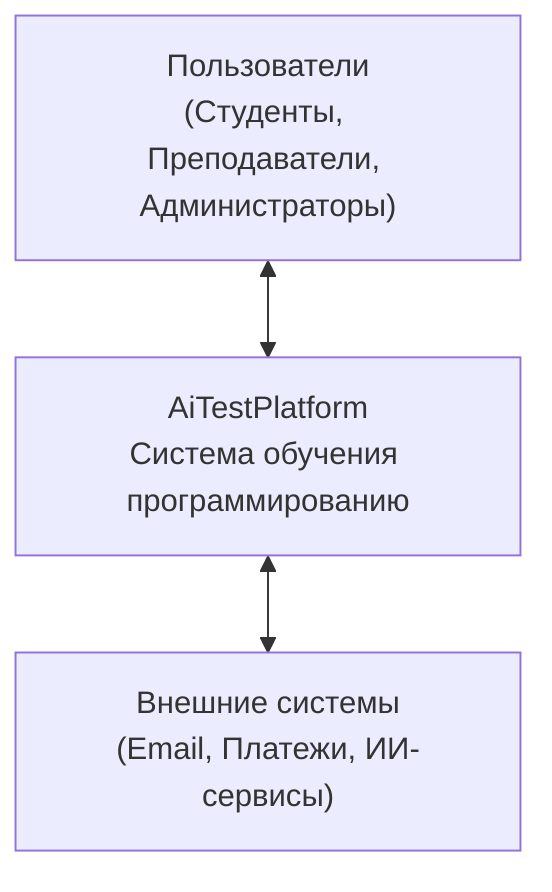
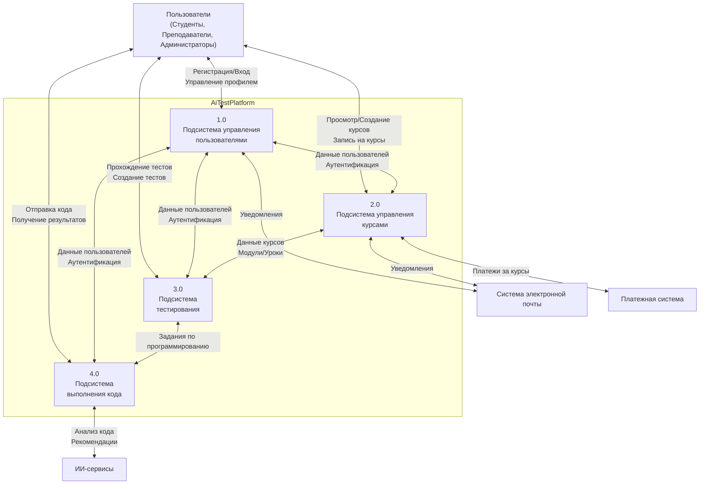
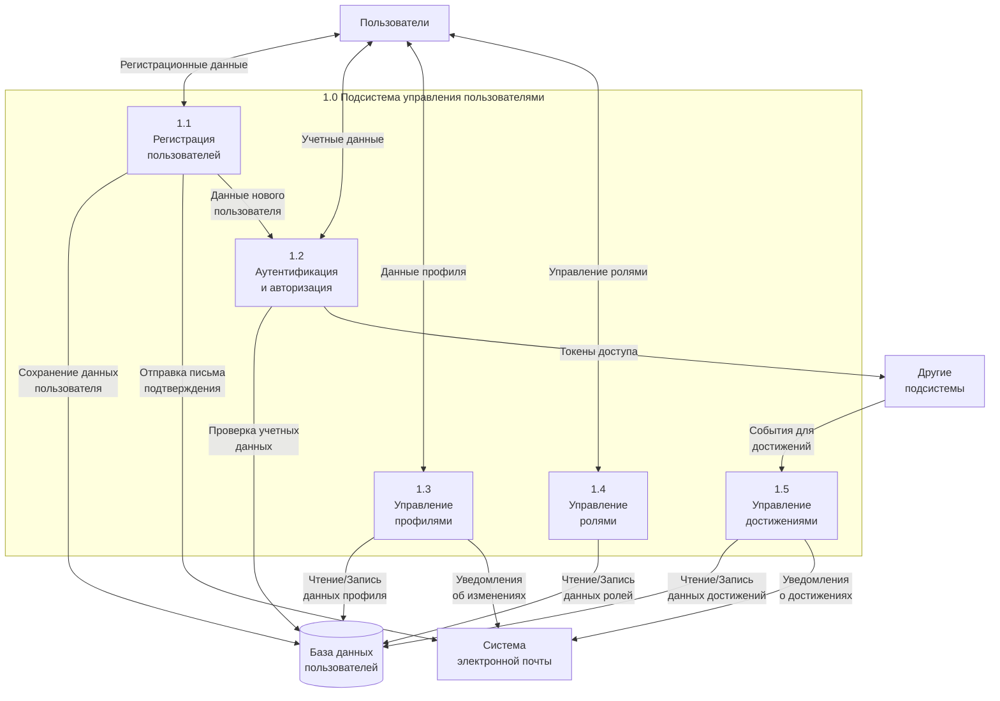
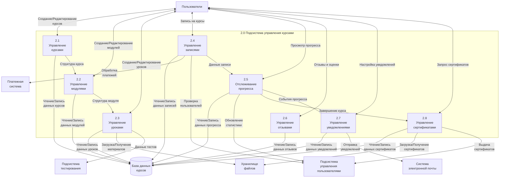
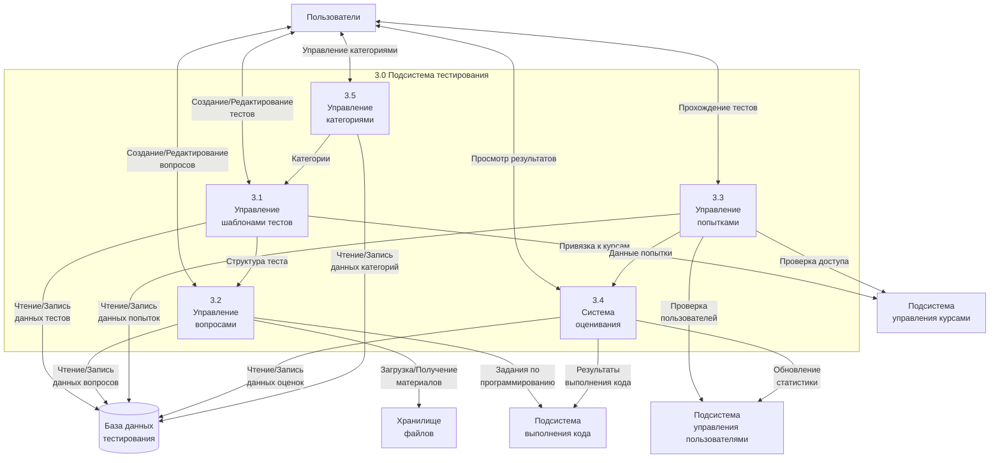
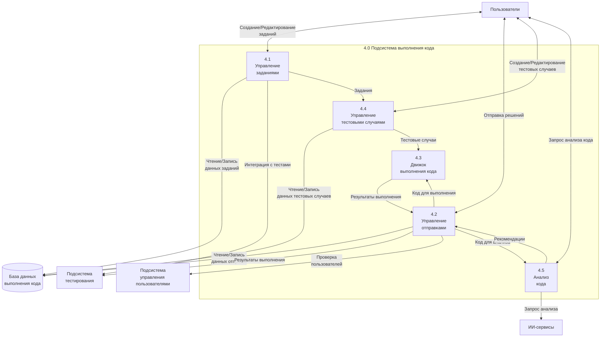
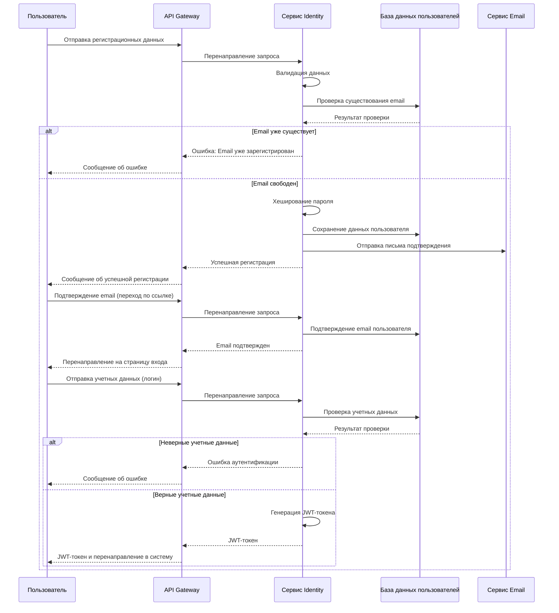
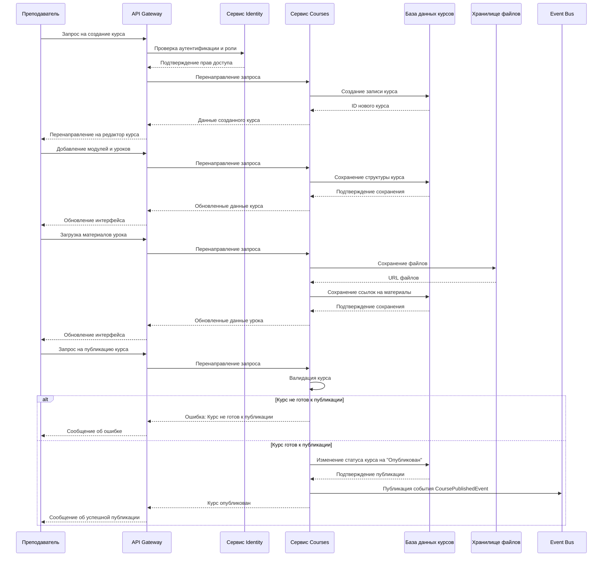
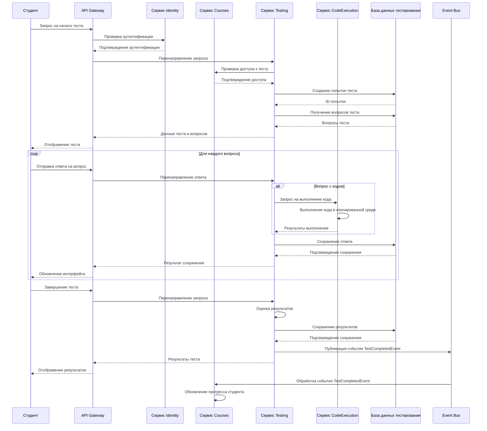
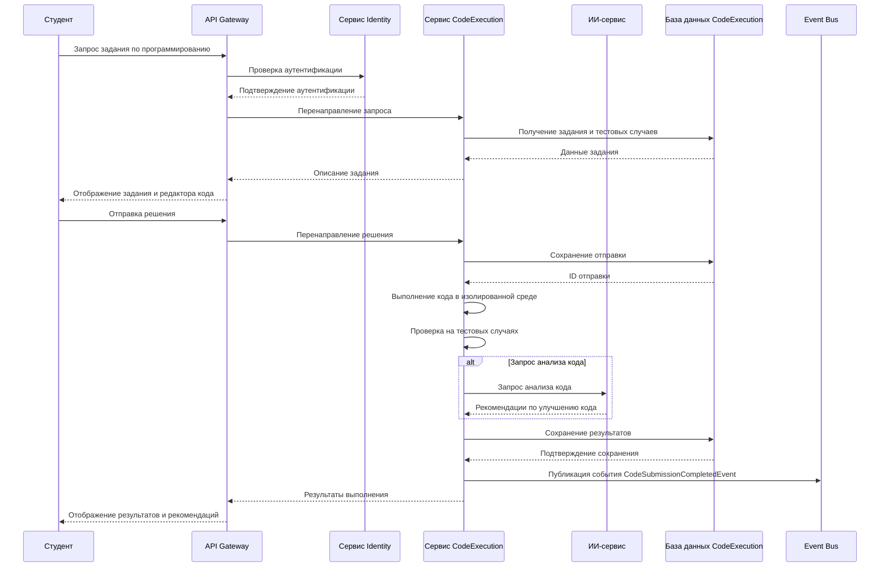

# Диаграммы потоков данных AiTestPlatform

В этом документе представлены диаграммы потоков данных (DFD) для визуализации обработки информации в системе AiTestPlatform.

## Содержание

1. [Контекстная диаграмма (DFD уровня 0)](#контекстная-диаграмма-dfd-уровня-0)
2. [Диаграмма первого уровня (DFD уровня 1)](#диаграмма-первого-уровня-dfd-уровня-1)
3. [Детализированные диаграммы (DFD уровня 2)](#детализированные-диаграммы-dfd-уровня-2)
   - [Подсистема управления пользователями](#подсистема-управления-пользователями)
   - [Подсистема управления курсами](#подсистема-управления-курсами)
   - [Подсистема тестирования](#подсистема-тестирования)
   - [Подсистема выполнения кода](#подсистема-выполнения-кода)
4. [Диаграммы потоков данных для ключевых процессов](#диаграммы-потоков-данных-для-ключевых-процессов)
   - [Процесс регистрации и аутентификации](#процесс-регистрации-и-аутентификации)
   - [Процесс создания и публикации курса](#процесс-создания-и-публикации-курса)
   - [Процесс прохождения теста](#процесс-прохождения-теста)
   - [Процесс выполнения задания по программированию](#процесс-выполнения-задания-по-программированию)

## Контекстная диаграмма (DFD уровня 0)

## Диаграмма первого уровня (DFD уровня 1)

## Детализированные диаграммы (DFD уровня 2)

### Подсистема управления пользователями

### Подсистема управления курсами

### Подсистема тестирования

### Подсистема выполнения кода

## Диаграммы потоков данных для ключевых процессов

### Процесс регистрации и аутентификации

### Процесс создания и публикации курса

### Процесс прохождения теста

### Процесс выполнения задания по программированию

## Заключение

Диаграммы потоков данных (DFD) предоставляют наглядное представление о том, как данные перемещаются внутри системы AiTestPlatform. Они помогают понять:

1. Как информация передается между различными компонентами системы
2. Какие процессы обрабатывают данные
3. Где данные хранятся
4. Как система взаимодействует с внешними сущностями

Эти диаграммы являются важным инструментом для разработчиков, аналитиков и других заинтересованных сторон, позволяя им лучше понять архитектуру системы и принципы ее работы.