# Диаграммы развертывания AiTestPlatform

В этом документе представлены диаграммы развертывания (Deployment Diagrams) для визуализации физической инфраструктуры системы AiTestPlatform и размещения компонентов на серверах.

## Содержание

1. [Общая схема развертывания](#общая-схема-развертывания)
2. [Развертывание в среде разработки](#развертывание-в-среде-разработки)
3. [Развертывание в тестовой среде](#развертывание-в-тестовой-среде)
4. [Развертывание в производственной среде](#развертывание-в-производственной-среде)
5. [Масштабирование системы](#масштабирование-системы)

## Общая схема развертывания

```mermaid
deploymentDiagram
    title Общая схема развертывания AiTestPlatform

    node "Клиентские устройства" {
        artifact "Web Browser" as browser
    }

    node "Балансировщик нагрузки" as loadBalancer {
        artifact "NGINX" as nginx
    }

    node "API Gateway" as apiGateway {
        artifact "Ocelot API Gateway" as ocelot
    }

    node "Identity Service" as identityService {
        artifact "Identity API" as identityApi
        artifact "Identity Domain" as identityDomain
        artifact "Identity Data" as identityData
    }

    node "Courses Service" as coursesService {
        artifact "Courses API" as coursesApi
        artifact "Courses Domain" as coursesDomain
        artifact "Courses Data" as coursesData
    }

    node "Testing Service" as testingService {
        artifact "Testing API" as testingApi
        artifact "Testing Domain" as testingDomain
        artifact "Testing Data" as testingData
    }

    node "CodeExecution Service" as codeService {
        artifact "CodeExecution API" as codeApi
        artifact "CodeExecution Domain" as codeDomain
        artifact "CodeExecution Data" as codeData
    }

    node "Docker Containers" as dockerContainers {
        artifact "Code Runner Containers" as codeRunnerContainers
    }

    node "Message Broker" as messageBroker {
        artifact "Kafka" as kafka
        artifact "Zookeeper" as zookeeper
    }

    node "Databases" as databases {
        artifact "Identity DB (PostgreSQL)" as identityDb
        artifact "Courses DB (PostgreSQL)" as coursesDb
        artifact "Testing DB (PostgreSQL)" as testingDb
        artifact "CodeExecution DB (PostgreSQL)" as codeDb
    }

    node "Storage" as storage {
        artifact "MinIO Object Storage" as minio
    }

    node "Monitoring" as monitoring {
        artifact "Prometheus" as prometheus
        artifact "Grafana" as grafana
    }

    node "Logging" as logging {
        artifact "Elasticsearch" as elasticsearch
        artifact "Kibana" as kibana
        artifact "Fluentd" as fluentd
    }

    browser --> nginx : HTTPS
    nginx --> ocelot : HTTP
    ocelot --> identityApi : HTTP
    ocelot --> coursesApi : HTTP
    ocelot --> testingApi : HTTP
    ocelot --> codeApi : HTTP

    identityApi --> identityDomain
    identityDomain --> identityData
    identityData --> identityDb : TCP

    coursesApi --> coursesDomain
    coursesDomain --> coursesData
    coursesData --> coursesDb : TCP
    coursesDomain --> minio : S3 API

    testingApi --> testingDomain
    testingDomain --> testingData
    testingData --> testingDb : TCP
    testingDomain --> minio : S3 API

    codeApi --> codeDomain
    codeDomain --> codeData
    codeData --> codeDb : TCP
    codeDomain --> codeRunnerContainers : Docker API
    codeDomain --> minio : S3 API

    identityDomain --> kafka : TCP
    coursesDomain --> kafka : TCP
    testingDomain --> kafka : TCP
    codeDomain --> kafka : TCP
    kafka --> zookeeper : TCP

    identityApi --> fluentd : Logs
    coursesApi --> fluentd : Logs
    testingApi --> fluentd : Logs
    codeApi --> fluentd : Logs
    fluentd --> elasticsearch : TCP
    elasticsearch --> kibana : TCP

    identityApi --> prometheus : Metrics
    coursesApi --> prometheus : Metrics
    testingApi --> prometheus : Metrics
    codeApi --> prometheus : Metrics
    prometheus --> grafana : TCP
```

## Развертывание в среде разработки

```mermaid
deploymentDiagram
    title Развертывание AiTestPlatform в среде разработки

    node "Рабочая станция разработчика" as devMachine {
        artifact "IDE (Visual Studio/VS Code)" as ide
        artifact "Web Browser" as browser
        artifact "Docker Desktop" as dockerDesktop
        artifact "Git" as git
    }

    node "Локальные Docker контейнеры" as localContainers {
        artifact "PostgreSQL" as postgres
        artifact "Kafka" as kafka
        artifact "Zookeeper" as zookeeper
        artifact "MinIO" as minio
    }

    node "Локальные микросервисы" as localServices {
        artifact "Identity Service" as identityService
        artifact "Courses Service" as coursesService
        artifact "Testing Service" as testingService
        artifact "CodeExecution Service" as codeService
        artifact "API Gateway" as apiGateway
    }

    node "Локальный Frontend" as localFrontend {
        artifact "React Application (npm start)" as reactApp
    }

    node "Репозиторий кода" as codeRepo {
        artifact "Git Repository" as gitRepo
    }

    ide --> git : Использует
    git --> gitRepo : Push/Pull
    ide --> localServices : Запускает/Отлаживает
    ide --> localFrontend : Запускает/Отлаживает
    browser --> reactApp : HTTP
    reactApp --> apiGateway : HTTP
    apiGateway --> identityService : HTTP
    apiGateway --> coursesService : HTTP
    apiGateway --> testingService : HTTP
    apiGateway --> codeService : HTTP
    identityService --> postgres : TCP
    coursesService --> postgres : TCP
    testingService --> postgres : TCP
    codeService --> postgres : TCP
    identityService --> kafka : TCP
    coursesService --> kafka : TCP
    testingService --> kafka : TCP
    codeService --> kafka : TCP
    kafka --> zookeeper : TCP
    coursesService --> minio : S3 API
    testingService --> minio : S3 API
    codeService --> minio : S3 API
    dockerDesktop --> localContainers : Управляет
```

## Развертывание в тестовой среде

```mermaid
deploymentDiagram
    title Развертывание AiTestPlatform в тестовой среде

    node "CI/CD Server" as cicd {
        artifact "Jenkins/GitHub Actions" as jenkins
        artifact "Build Pipelines" as buildPipelines
        artifact "Test Pipelines" as testPipelines
        artifact "Deployment Pipelines" as deployPipelines
    }

    node "Kubernetes Cluster (Test)" as k8sTest {
        node "Frontend Pod" as frontendPod {
            artifact "React Application" as reactApp
            artifact "NGINX" as nginx
        }

        node "API Gateway Pod" as gatewayPod {
            artifact "Ocelot API Gateway" as ocelot
        }

        node "Identity Service Pod" as identityPod {
            artifact "Identity Service" as identityService
        }

        node "Courses Service Pod" as coursesPod {
            artifact "Courses Service" as coursesService
        }

        node "Testing Service Pod" as testingPod {
            artifact "Testing Service" as testingService
        }

        node "CodeExecution Service Pod" as codePod {
            artifact "CodeExecution Service" as codeService
        }

        node "Code Runner Pods" as runnerPods {
            artifact "Code Runner Containers" as codeRunners
        }

        node "Database Pods" as dbPods {
            artifact "PostgreSQL (Identity)" as identityDb
            artifact "PostgreSQL (Courses)" as coursesDb
            artifact "PostgreSQL (Testing)" as testingDb
            artifact "PostgreSQL (CodeExecution)" as codeDb
        }

        node "Kafka Pod" as kafkaPod {
            artifact "Kafka" as kafka
            artifact "Zookeeper" as zookeeper
        }

        node "MinIO Pod" as minioPod {
            artifact "MinIO Object Storage" as minio
        }

        node "Monitoring Pods" as monitoringPods {
            artifact "Prometheus" as prometheus
            artifact "Grafana" as grafana
        }

        node "Logging Pods" as loggingPods {
            artifact "EFK Stack" as efk
        }
    }

    node "Test Clients" as testClients {
        artifact "Web Browsers" as browsers
        artifact "Automated Tests" as automatedTests
    }

    node "Code Repository" as codeRepo {
        artifact "Git Repository" as gitRepo
    }

    gitRepo --> jenkins : Triggers
    jenkins --> buildPipelines : Executes
    buildPipelines --> testPipelines : Triggers
    testPipelines --> deployPipelines : Triggers
    deployPipelines --> k8sTest : Deploys to

    browsers --> nginx : HTTPS
    automatedTests --> nginx : HTTPS
    nginx --> ocelot : HTTP
    ocelot --> identityService : HTTP
    ocelot --> coursesService : HTTP
    ocelot --> testingService : HTTP
    ocelot --> codeService : HTTP

    identityService --> identityDb : TCP
    coursesService --> coursesDb : TCP
    testingService --> testingDb : TCP
    codeService --> codeDb : TCP

    identityService --> kafka : TCP
    coursesService --> kafka : TCP
    testingService --> kafka : TCP
    codeService --> kafka : TCP
    kafka --> zookeeper : TCP

    coursesService --> minio : S3 API
    testingService --> minio : S3 API
    codeService --> minio : S3 API

    codeService --> codeRunners : Manages

    identityService --> prometheus : Metrics
    coursesService --> prometheus : Metrics
    testingService --> prometheus : Metrics
    codeService --> prometheus : Metrics
    prometheus --> grafana : Data

    identityService --> efk : Logs
    coursesService --> efk : Logs
    testingService --> efk : Logs
    codeService --> efk : Logs
```

## Развертывание в производственной среде

```mermaid
deploymentDiagram
    title Развертывание AiTestPlatform в производственной среде

    node "CI/CD Pipeline" as cicd {
        artifact "Jenkins/GitHub Actions" as jenkins
        artifact "Production Deployment Pipeline" as prodPipeline
    }

    node "Load Balancer" as lb {
        artifact "NGINX/Cloud Load Balancer" as lbService
    }

    node "Kubernetes Cluster (Production)" as k8sProd {
        node "Frontend Pods" as frontendPods {
            artifact "React Application" as reactApp
            artifact "NGINX" as nginx
        }

        node "API Gateway Pods" as gatewayPods {
            artifact "Ocelot API Gateway" as ocelot
        }

        node "Identity Service Pods" as identityPods {
            artifact "Identity Service" as identityService
        }

        node "Courses Service Pods" as coursesPods {
            artifact "Courses Service" as coursesService
        }

        node "Testing Service Pods" as testingPods {
            artifact "Testing Service" as testingService
        }

        node "CodeExecution Service Pods" as codePods {
            artifact "CodeExecution Service" as codeService
        }

        node "Code Runner Pods" as runnerPods {
            artifact "Code Runner Containers" as codeRunners
        }
    }

    node "Database Cluster" as dbCluster {
        artifact "PostgreSQL (Identity) Master" as identityDbMaster
        artifact "PostgreSQL (Identity) Replicas" as identityDbReplicas
        artifact "PostgreSQL (Courses) Master" as coursesDbMaster
        artifact "PostgreSQL (Courses) Replicas" as coursesDbReplicas
        artifact "PostgreSQL (Testing) Master" as testingDbMaster
        artifact "PostgreSQL (Testing) Replicas" as testingDbReplicas
        artifact "PostgreSQL (CodeExecution) Master" as codeDbMaster
        artifact "PostgreSQL (CodeExecution) Replicas" as codeDbReplicas
    }

    node "Kafka Cluster" as kafkaCluster {
        artifact "Kafka Brokers" as kafkaBrokers
        artifact "Zookeeper Ensemble" as zookeeperEnsemble
    }

    node "Storage Cluster" as storageCluster {
        artifact "MinIO Distributed Storage" as minioCluster
    }

    node "Monitoring & Alerting" as monitoring {
        artifact "Prometheus" as prometheus
        artifact "Grafana" as grafana
        artifact "Alert Manager" as alertManager
    }

    node "Logging System" as logging {
        artifact "Elasticsearch Cluster" as elasticsearchCluster
        artifact "Kibana" as kibana
        artifact "Fluentd/Fluent Bit" as fluentd
    }

    node "Backup System" as backup {
        artifact "Backup Service" as backupService
        artifact "Backup Storage" as backupStorage
    }

    node "Clients" as clients {
        artifact "Web Browsers" as browsers
        artifact "Mobile Devices" as mobileDevices
    }

    jenkins --> prodPipeline : Executes
    prodPipeline --> k8sProd : Deploys to

    browsers --> lbService : HTTPS
    mobileDevices --> lbService : HTTPS
    lbService --> nginx : HTTPS
    nginx --> ocelot : HTTP
    ocelot --> identityService : HTTP
    ocelot --> coursesService : HTTP
    ocelot --> testingService : HTTP
    ocelot --> codeService : HTTP

    identityService --> identityDbMaster : TCP
    identityDbMaster --> identityDbReplicas : Replication
    coursesService --> coursesDbMaster : TCP
    coursesDbMaster --> coursesDbReplicas : Replication
    testingService --> testingDbMaster : TCP
    testingDbMaster --> testingDbReplicas : Replication
    codeService --> codeDbMaster : TCP
    codeDbMaster --> codeDbReplicas : Replication

    identityService --> kafkaBrokers : TCP
    coursesService --> kafkaBrokers : TCP
    testingService --> kafkaBrokers : TCP
    codeService --> kafkaBrokers : TCP
    kafkaBrokers --> zookeeperEnsemble : TCP

    coursesService --> minioCluster : S3 API
    testingService --> minioCluster : S3 API
    codeService --> minioCluster : S3 API

    codeService --> codeRunners : Manages

    identityService --> fluentd : Logs
    coursesService --> fluentd : Logs
    testingService --> fluentd : Logs
    codeService --> fluentd : Logs
    fluentd --> elasticsearchCluster : Sends logs
    elasticsearchCluster --> kibana : Data

    identityService --> prometheus : Metrics
    coursesService --> prometheus : Metrics
    testingService --> prometheus : Metrics
    codeService --> prometheus : Metrics
    prometheus --> grafana : Data
    prometheus --> alertManager : Alerts

    identityDbMaster --> backupService : Backed up
    coursesDbMaster --> backupService : Backed up
    testingDbMaster --> backupService : Backed up
    codeDbMaster --> backupService : Backed up
    minioCluster --> backupService : Backed up
    backupService --> backupStorage : Stores backups
```

## Масштабирование системы

```mermaid
flowchart TD
    title["Стратегия масштабирования AiTestPlatform"] --> horizontal["Горизонтальное масштабирование"]
    title --> vertical["Вертикальное масштабирование"]
    title --> data["Масштабирование данных"]
    title --> geo["Географическое масштабирование"]

    horizontal --> hFrontend["Масштабирование Frontend"]
    horizontal --> hServices["Масштабирование микросервисов"]
    horizontal --> hGateway["Масштабирование API Gateway"]
    horizontal --> hRunners["Масштабирование Code Runners"]

    vertical --> vServices["Увеличение ресурсов для микросервисов"]
    vertical --> vDB["Увеличение ресурсов для баз данных"]
    vertical --> vKafka["Увеличение ресурсов для Kafka"]

    data --> sharding["Шардирование баз данных"]
    data --> caching["Внедрение кэширования"]
    data --> readReplicas["Репликация для чтения"]

    geo --> cdn["Использование CDN"]
    geo --> multiRegion["Мульти-региональное развертывание"]
    geo --> edgeComputing["Edge Computing"]

    hFrontend --> staticServing["Статический контент через CDN"]
    hFrontend --> multipleInstances["Несколько экземпляров приложения"]

    hServices --> autoScaling["Автоматическое масштабирование на основе нагрузки"]
    hServices --> serviceInstances["Несколько экземпляров каждого сервиса"]

    hGateway --> gatewayInstances["Несколько экземпляров API Gateway"]
    hGateway --> gatewayLB["Балансировка нагрузки для Gateway"]

    hRunners --> runnerPool["Пул контейнеров для выполнения кода"]
    hRunners --> runnerScaling["Динамическое масштабирование контейнеров"]

    sharding --> courseSharding["Шардирование по курсам"]
    sharding --> userSharding["Шардирование по пользователям"]

    caching --> redisCache["Redis для кэширования"]
    caching --> inMemoryCache["In-memory кэширование"]

    readReplicas --> dbReplicas["Репликация баз данных"]
    readReplicas --> readWriteSplit["Разделение операций чтения и записи"]

    cdn --> staticContent["Статический контент"]
    cdn --> mediaContent["Медиа-контент"]

    multiRegion --> regionDeploy["Развертывание в нескольких регионах"]
    multiRegion --> dataSync["Синхронизация данных между регионами"]

    edgeComputing --> edgeCaching["Кэширование на Edge"]
    edgeComputing --> edgeProcessing["Обработка на Edge"]
```



## Заключение

Диаграммы развертывания (Deployment Diagrams) предоставляют детальное представление о физической инфраструктуре системы AiTestPlatform и размещении компонентов на серверах. Они помогают понять:

1. Общую архитектуру развертывания системы
2. Особенности развертывания в различных средах (разработка, тестирование, производство)
3. Взаимодействие между компонентами на физическом уровне
4. Стратегии масштабирования системы

Эти диаграммы являются важным инструментом для DevOps-инженеров, системных администраторов и архитекторов, позволяя им планировать и оптимизировать инфраструктуру системы.