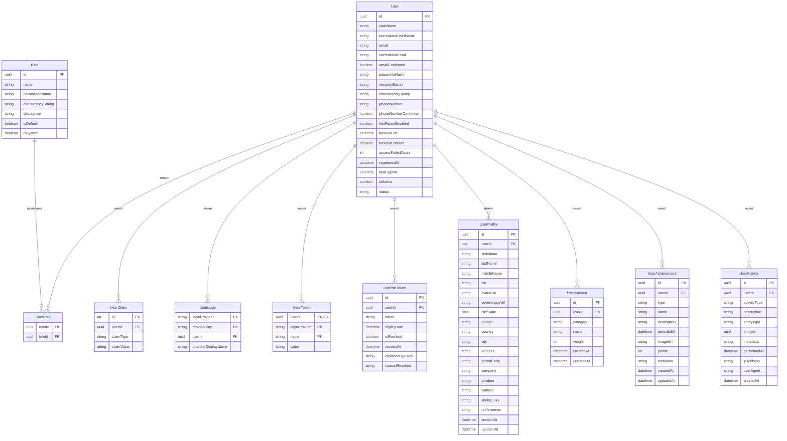

# Схема базы данных микросервиса Identity

В этом документе описана структура базы данных для микросервиса Identity в системе AiTestPlatform.

## ER-диаграмма



## Описание таблиц

### User
Содержит основную информацию о пользователях системы.

| Поле | Тип | Описание |
|------|-----|----------|
| id | uuid | Первичный ключ |
| userName | string | Имя пользователя |
| normalizedUserName | string | Нормализованное имя пользователя (для поиска) |
| email | string | Email пользователя |
| normalizedEmail | string | Нормализованный email (для поиска) |
| emailConfirmed | boolean | Подтвержден ли email |
| passwordHash | string | Хеш пароля |
| securityStamp | string | Метка безопасности |
| concurrencyStamp | string | Метка для обработки конкурентных запросов |
| phoneNumber | string | Номер телефона |
| phoneNumberConfirmed | boolean | Подтвержден ли номер телефона |
| twoFactorEnabled | boolean | Включена ли двухфакторная аутентификация |
| lockoutEnd | datetime | Время окончания блокировки |
| lockoutEnabled | boolean | Включена ли возможность блокировки |
| accessFailedCount | int | Количество неудачных попыток входа |
| registeredAt | datetime | Дата регистрации |
| lastLoginAt | datetime | Дата последнего входа |
| isActive | boolean | Активен ли пользователь |
| status | string | Статус пользователя |

### Role
Содержит роли пользователей в системе.

| Поле | Тип | Описание |
|------|-----|----------|
| id | uuid | Первичный ключ |
| name | string | Название роли |
| normalizedName | string | Нормализованное название (для поиска) |
| concurrencyStamp | string | Метка для обработки конкурентных запросов |
| description | string | Описание роли |
| isDefault | boolean | Является ли ролью по умолчанию |
| isSystem | boolean | Является ли системной ролью |

### UserRole
Связывает пользователей с ролями (многие ко многим).

| Поле | Тип | Описание |
|------|-----|----------|
| userId | uuid | ID пользователя (внешний ключ) |
| roleId | uuid | ID роли (внешний ключ) |

### UserClaim
Содержит утверждения (claims) пользователей для авторизации.

| Поле | Тип | Описание |
|------|-----|----------|
| id | int | Первичный ключ |
| userId | uuid | ID пользователя (внешний ключ) |
| claimType | string | Тип утверждения |
| claimValue | string | Значение утверждения |

### UserLogin
Содержит информацию о внешних провайдерах аутентификации.

| Поле | Тип | Описание |
|------|-----|----------|
| loginProvider | string | Провайдер входа (часть составного ключа) |
| providerKey | string | Ключ провайдера (часть составного ключа) |
| userId | uuid | ID пользователя (внешний ключ) |
| providerDisplayName | string | Отображаемое имя провайдера |

### UserToken
Содержит токены пользователей для различных целей.

| Поле | Тип | Описание |
|------|-----|----------|
| userId | uuid | ID пользователя (часть составного ключа) |
| loginProvider | string | Провайдер (часть составного ключа) |
| name | string | Имя токена (часть составного ключа) |
| value | string | Значение токена |

### RefreshToken
Содержит токены обновления для JWT аутентификации.

| Поле | Тип | Описание |
|------|-----|----------|
| id | uuid | Первичный ключ |
| userId | uuid | ID пользователя (внешний ключ) |
| token | string | Токен обновления |
| expiryDate | datetime | Дата истечения срока действия |
| isRevoked | boolean | Отозван ли токен |
| createdAt | datetime | Дата создания |
| replacedByToken | string | Токен, заменивший этот (если есть) |
| reasonRevoked | string | Причина отзыва |

### UserProfile
Содержит расширенную информацию о профиле пользователя.

| Поле | Тип | Описание |
|------|-----|----------|
| id | uuid | Первичный ключ |
| userId | uuid | ID пользователя (внешний ключ) |
| firstName | string | Имя |
| lastName | string | Фамилия |
| middleName | string | Отчество |
| bio | string | Биография |
| avatarUrl | string | URL аватара |
| coverImageUrl | string | URL обложки профиля |
| birthDate | date | Дата рождения |
| gender | string | Пол |
| country | string | Страна |
| city | string | Город |
| address | string | Адрес |
| postalCode | string | Почтовый индекс |
| company | string | Компания |
| position | string | Должность |
| website | string | Веб-сайт |
| socialLinks | string | JSON с ссылками на социальные сети |
| preferences | string | JSON с предпочтениями пользователя |
| createdAt | datetime | Дата создания |
| updatedAt | datetime | Дата обновления |

### UserInterest
Содержит интересы пользователей для рекомендаций.

| Поле | Тип | Описание |
|------|-----|----------|
| id | uuid | Первичный ключ |
| userId | uuid | ID пользователя (внешний ключ) |
| category | string | Категория интереса |
| name | string | Название интереса |
| weight | int | Вес интереса (для алгоритма рекомендаций) |
| createdAt | datetime | Дата создания |
| updatedAt | datetime | Дата обновления |

### UserAchievement
Содержит достижения пользователей.

| Поле | Тип | Описание |
|------|-----|----------|
| id | uuid | Первичный ключ |
| userId | uuid | ID пользователя (внешний ключ) |
| type | string | Тип достижения |
| name | string | Название достижения |
| description | string | Описание достижения |
| awardedAt | datetime | Дата получения |
| imageUrl | string | URL изображения достижения |
| points | int | Количество очков |
| metadata | string | JSON с дополнительными данными |
| createdAt | datetime | Дата создания |
| updatedAt | datetime | Дата обновления |

### UserActivity
Содержит историю активности пользователей.

| Поле | Тип | Описание |
|------|-----|----------|
| id | uuid | Первичный ключ |
| userId | uuid | ID пользователя (внешний ключ) |
| activityType | string | Тип активности |
| description | string | Описание активности |
| entityType | string | Тип связанной сущности |
| entityId | uuid | ID связанной сущности |
| metadata | string | JSON с дополнительными данными |
| performedAt | datetime | Время выполнения активности |
| ipAddress | string | IP-адрес |
| userAgent | string | User-Agent браузера |
| createdAt | datetime | Дата создания записи |

## Индексы

- User: индексы по normalizedUserName, normalizedEmail
- UserRole: составной индекс по userId, roleId
- UserClaim: индекс по userId
- UserLogin: индекс по userId
- UserToken: индекс по userId
- RefreshToken: индексы по userId, token
- UserProfile: уникальный индекс по userId
- UserInterest: индекс по userId
- UserAchievement: индекс по userId
- UserActivity: индексы по userId, performedAt

## Миграции Entity Framework Core

Для создания и обновления базы данных используйте следующие команды Entity Framework Core:

```bash
# Создание миграции
dotnet ef migrations add InitialIdentitySchema --project src/Services/Identity/Identity.Infrastructure --startup-project src/Services/Identity/Identity.API

# Применение миграции
dotnet ef database update --project src/Services/Identity/Identity.Infrastructure --startup-project src/Services/Identity/Identity.API
```