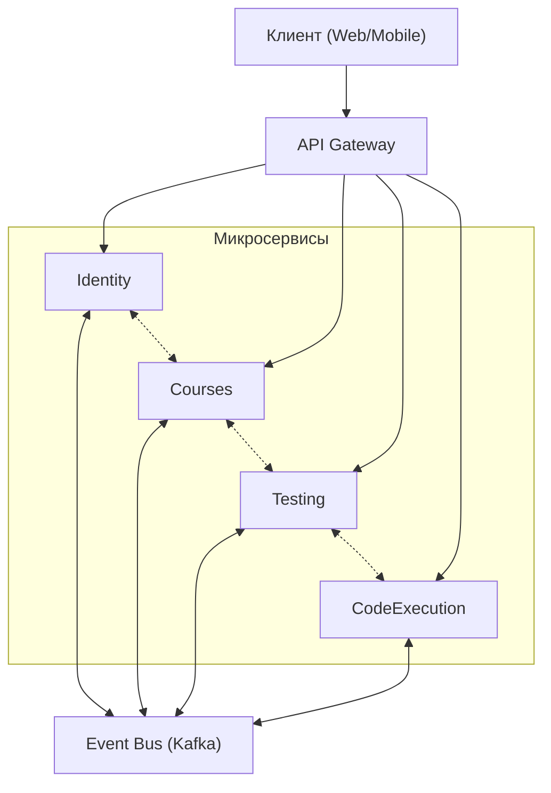
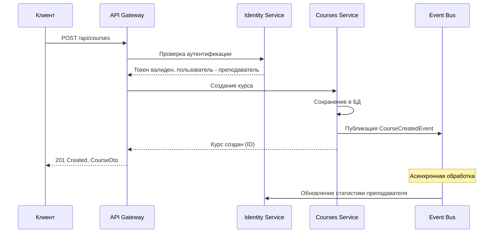
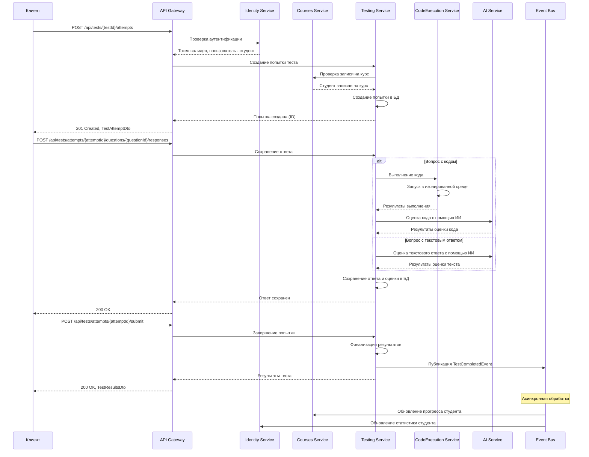
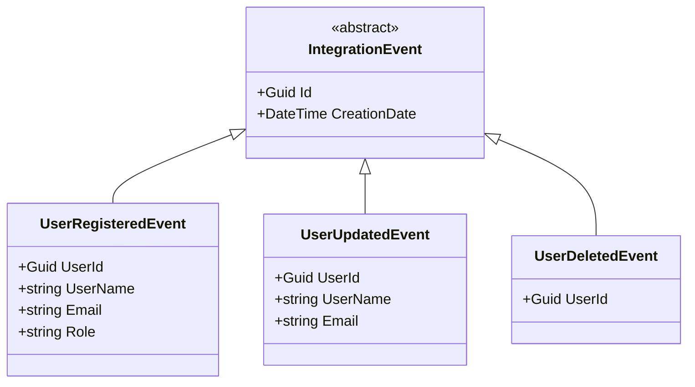
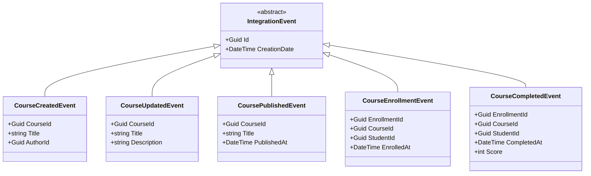
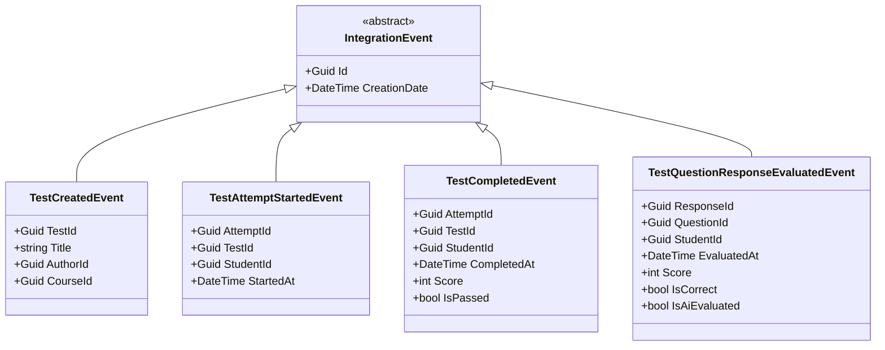
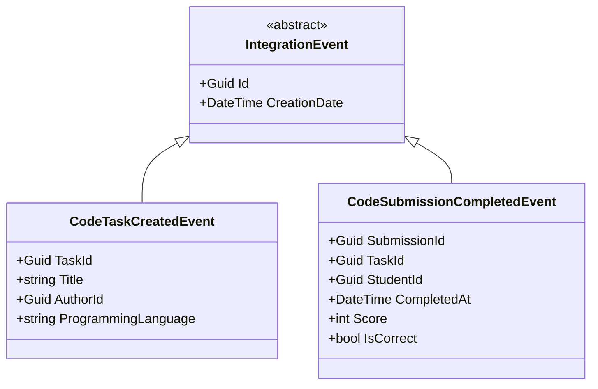
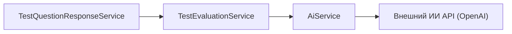
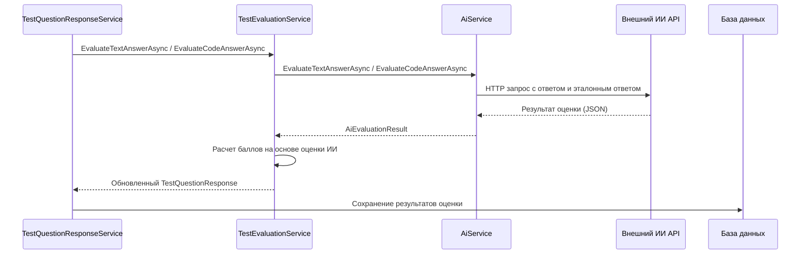

# Взаимодействие микросервисов в AiTestPlatform

В этом документе описано взаимодействие между микросервисами в системе AiTestPlatform.

## Диаграмма взаимодействия микросервисов



## Последовательность взаимодействия при создании курса



## Последовательность взаимодействия при прохождении теста



## События интеграции (Integration Events)

### События микросервиса Identity



### События микросервиса Courses



### События микросервиса Testing



### События микросервиса CodeExecution



## Обработчики событий (Event Handlers)

### Обработчики в микросервисе Identity

```csharp
public class CourseCompletedEventHandler : IIntegrationEventHandler<CourseCompletedEvent>
{
    private readonly IUserRepository _userRepository;
    private readonly ILogService _logService;
    
    public CourseCompletedEventHandler(IUserRepository userRepository, ILogService logService)
    {
        _userRepository = userRepository;
        _logService = logService;
    }
    
    public async Task Handle(CourseCompletedEvent @event)
    {
        try
        {
            // Обновление статистики пользователя
            await _userRepository.UpdateUserStatisticsAsync(
                @event.StudentId,
                completedCourseId: @event.CourseId,
                score: @event.Score);
                
            // Добавление достижения, если применимо
            await _userRepository.AddAchievementIfEligibleAsync(
                @event.StudentId,
                "CourseCompletion",
                $"Completed course {@event.CourseId}");
                
            _logService.LogInformation(
                "Updated statistics for user {UserId} after completing course {CourseId}",
                @event.StudentId, @event.CourseId);
        }
        catch (Exception ex)
        {
            _logService.LogError(ex,
                "Error handling CourseCompletedEvent for user {UserId} and course {CourseId}",
                @event.StudentId, @event.CourseId);
        }
    }
}
```

### Обработчики в микросервисе Courses

```csharp
public class TestCompletedEventHandler : IIntegrationEventHandler<TestCompletedEvent>
{
    private readonly IEnrollmentRepository _enrollmentRepository;
    private readonly ILessonProgressRepository _lessonProgressRepository;
    private readonly ILogService _logService;
    
    public TestCompletedEventHandler(
        IEnrollmentRepository enrollmentRepository,
        ILessonProgressRepository lessonProgressRepository,
        ILogService logService)
    {
        _enrollmentRepository = enrollmentRepository;
        _lessonProgressRepository = lessonProgressRepository;
        _logService = logService;
    }
    
    public async Task Handle(TestCompletedEvent @event)
    {
        try
        {
            // Получение информации о тесте и связанном уроке
            var testInfo = await _enrollmentRepository.GetTestInfoAsync(@event.TestId);
            
            if (testInfo == null)
            {
                _logService.LogWarning(
                    "Test {TestId} not found when handling TestCompletedEvent",
                    @event.TestId);
                return;
            }
            
            // Обновление прогресса по уроку
            if (testInfo.LessonId.HasValue)
            {
                await _lessonProgressRepository.UpdateProgressAsync(
                    @event.StudentId,
                    testInfo.LessonId.Value,
                    testCompleted: true,
                    testScore: @event.Score,
                    testPassed: @event.IsPassed);
                    
                _logService.LogInformation(
                    "Updated lesson progress for student {StudentId}, lesson {LessonId}",
                    @event.StudentId, testInfo.LessonId.Value);
            }
            
            // Проверка завершения курса
            if (testInfo.CourseId.HasValue)
            {
                var isCompleted = await _enrollmentRepository.CheckCourseCompletionAsync(
                    @event.StudentId,
                    testInfo.CourseId.Value);
                    
                if (isCompleted)
                {
                    await _enrollmentRepository.CompleteCourseAsync(
                        @event.StudentId,
                        testInfo.CourseId.Value);
                        
                    _logService.LogInformation(
                        "Course {CourseId} completed by student {StudentId}",
                        testInfo.CourseId.Value, @event.StudentId);
                }
            }
        }
        catch (Exception ex)
        {
            _logService.LogError(ex,
                "Error handling TestCompletedEvent for student {StudentId} and test {TestId}",
                @event.StudentId, @event.TestId);
        }
    }
}
```

## Конфигурация Event Bus

### Регистрация Event Bus в Startup.cs

```csharp
public void ConfigureServices(IServiceCollection services)
{
    // Регистрация EventBus
    services.AddSingleton<IEventBus, EventBusKafka>(sp =>
    {
        var kafkaConnection = Configuration["EventBusConnection"];
        var kafkaGroupId = Configuration["EventBusGroupId"];
        var logService = sp.GetRequiredService<ILogService>();
        var serviceProvider = sp.GetRequiredService<IServiceProvider>();
        
        return new EventBusKafka(kafkaConnection, kafkaGroupId, logService, serviceProvider);
    });
    
    // Регистрация обработчиков событий
    services.AddTransient<UserRegisteredEventHandler>();
    services.AddTransient<CourseCreatedEventHandler>();
    services.AddTransient<TestCompletedEventHandler>();
    // Другие обработчики...
}

public void Configure(IApplicationBuilder app, IWebHostEnvironment env)
{
    // Конфигурация подписок на события
    var eventBus = app.ApplicationServices.GetRequiredService<IEventBus>();
    
    eventBus.Subscribe<UserRegisteredEvent, UserRegisteredEventHandler>();
    eventBus.Subscribe<CourseCreatedEvent, CourseCreatedEventHandler>();
    eventBus.Subscribe<TestCompletedEvent, TestCompletedEventHandler>();
    // Другие подписки...
}
```

### Реализация EventBusKafka

```csharp
public class EventBusKafka : IEventBus
{
    private readonly IProducer<string, string> _producer;
    private readonly IConsumer<string, string> _consumer;
    private readonly IServiceProvider _serviceProvider;
    private readonly ILogService _logService;
    private readonly string _groupId;
    private readonly Dictionary<string, List<Type>> _eventHandlerTypes;
    
    public EventBusKafka(
        string connectionString,
        string groupId,
        ILogService logService,
        IServiceProvider serviceProvider)
    {
        _serviceProvider = serviceProvider;
        _logService = logService;
        _groupId = groupId;
        _eventHandlerTypes = new Dictionary<string, List<Type>>();
        
        // Конфигурация Kafka Producer
        var producerConfig = new ProducerConfig
        {
            BootstrapServers = connectionString,
            Acks = Acks.All
        };
        _producer = new ProducerBuilder<string, string>(producerConfig).Build();
        
        // Конфигурация Kafka Consumer
        var consumerConfig = new ConsumerConfig
        {
            BootstrapServers = connectionString,
            GroupId = groupId,
            AutoOffsetReset = AutoOffsetReset.Earliest,
            EnableAutoCommit = false
        };
        _consumer = new ConsumerBuilder<string, string>(consumerConfig).Build();
        
        // Запуск обработки сообщений в фоновом режиме
        Task.Factory.StartNew(ProcessMessages, TaskCreationOptions.LongRunning);
    }
    
    public async Task PublishAsync<T>(T @event) where T : IntegrationEvent
    {
        var eventName = @event.GetType().Name;
        var message = JsonSerializer.Serialize(@event);
        
        try
        {
            await _producer.ProduceAsync(eventName, new Message<string, string>
            {
                Key = @event.Id.ToString(),
                Value = message
            });
            
            _logService.LogInformation(
                "Published event {EventName} with ID {EventId}",
                eventName, @event.Id);
        }
        catch (Exception ex)
        {
            _logService.LogError(ex,
                "Error publishing event {EventName} with ID {EventId}",
                eventName, @event.Id);
            throw;
        }
    }
    
    public void Subscribe<T, TH>()
        where T : IntegrationEvent
        where TH : IIntegrationEventHandler<T>
    {
        var eventName = typeof(T).Name;
        var handlerType = typeof(TH);
        
        if (!_eventHandlerTypes.ContainsKey(eventName))
        {
            _eventHandlerTypes[eventName] = new List<Type>();
            _consumer.Subscribe(eventName);
        }
        
        if (_eventHandlerTypes[eventName].Contains(handlerType))
        {
            _logService.LogWarning(
                "Handler {HandlerName} already registered for event {EventName}",
                handlerType.Name, eventName);
            return;
        }
        
        _eventHandlerTypes[eventName].Add(handlerType);
        
        _logService.LogInformation(
            "Subscribed to event {EventName} with handler {HandlerName}",
            eventName, handlerType.Name);
    }
    
    public void Unsubscribe<T, TH>()
        where T : IntegrationEvent
        where TH : IIntegrationEventHandler<T>
    {
        var eventName = typeof(T).Name;
        var handlerType = typeof(TH);
        
        if (!_eventHandlerTypes.ContainsKey(eventName))
            return;
            
        _eventHandlerTypes[eventName].Remove(handlerType);
        
        if (_eventHandlerTypes[eventName].Count == 0)
        {
            _eventHandlerTypes.Remove(eventName);
            _consumer.Unsubscribe(new[] { eventName });
        }
        
        _logService.LogInformation(
            "Unsubscribed from event {EventName} with handler {HandlerName}",
            eventName, handlerType.Name);
    }
    
    private async Task ProcessMessages()
    {
        while (true)
        {
            try
            {
                var consumeResult = _consumer.Consume(TimeSpan.FromMilliseconds(100));
                
                if (consumeResult == null)
                    continue;
                    
                var eventName = consumeResult.Topic;
                var message = consumeResult.Message.Value;
                
                if (_eventHandlerTypes.ContainsKey(eventName))
                {
                    await ProcessEvent(eventName, message);
                }
                
                _consumer.Commit(consumeResult);
            }
            catch (Exception ex)
            {
                _logService.LogError(ex, "Error processing message from Kafka");
            }
        }
    }
    
    private async Task ProcessEvent(string eventName, string message)
    {
        if (!_eventHandlerTypes.ContainsKey(eventName))
            return;
            
        using var scope = _serviceProvider.CreateScope();
        
        foreach (var handlerType in _eventHandlerTypes[eventName])
        {
            try
            {
                var handler = scope.ServiceProvider.GetService(handlerType);
                
                if (handler == null)
                {
                    _logService.LogWarning(
                        "Handler {HandlerName} not registered in DI container",
                        handlerType.Name);
                    continue;
                }
                
                var eventType = _eventHandlerTypes[eventName]
                    .Select(t => t.GetInterfaces())
                    .SelectMany(i => i)
                    .Where(i => i.IsGenericType && i.GetGenericTypeDefinition() == typeof(IIntegrationEventHandler<>))
                    .Select(i => i.GetGenericArguments()[0])
                    .First(t => t.Name == eventName);
                    
                var @event = JsonSerializer.Deserialize(message, eventType);
                var concreteType = typeof(IIntegrationEventHandler<>).MakeGenericType(eventType);
                var handleMethod = concreteType.GetMethod("Handle");
                
                await (Task)handleMethod.Invoke(handler, new[] { @event });
            }
            catch (Exception ex)
            {
                _logService.LogError(ex,
                    "Error handling event {EventName} with handler {HandlerName}",
                    eventName, handlerType.Name);
            }
        }
    }
}
```

## Преимущества микросервисной архитектуры в AiTestPlatform

1. **Независимая разработка и развертывание** - каждый микросервис может разрабатываться, тестироваться и развертываться независимо от других.

2. **Масштабируемость** - микросервисы можно масштабировать независимо в зависимости от нагрузки. Например, CodeExecution может требовать больше ресурсов, чем другие сервисы.

3. **Технологическая гибкость** - каждый микросервис может использовать наиболее подходящие технологии и инструменты для своих задач.

4. **Устойчивость к сбоям** - сбой в одном микросервисе не приводит к отказу всей системы.

5. **Четкое разделение ответственности** - каждый микросервис отвечает за конкретную бизнес-функцию.

## Интеграция с ИИ сервисом для оценки тестов

В микросервисе Testing реализована интеграция с внешним ИИ сервисом для автоматической оценки ответов на вопросы с текстовым ответом и вопросы с кодом.

### Архитектура интеграции с ИИ



### Последовательность оценки ответа с помощью ИИ



### Конфигурация ИИ сервиса

Конфигурация для подключения к внешнему ИИ API хранится в appsettings.json:

```json
{
  "AiService": {
    "ApiKey": "your-api-key-here",
    "ApiEndpoint": "https://api.openai.com/v1/chat/completions"
  }
}
```

## Проблемы и решения

1. **Согласованность данных** - использование шаблона Event Sourcing и CQRS для обеспечения согласованности данных между микросервисами.

2. **Сложность распределенных транзакций** - использование шаблона Saga для управления распределенными транзакциями.

3. **Мониторинг и отладка** - централизованное логирование и трассировка запросов через все микросервисы.

4. **Аутентификация и авторизация** - использование JWT-токенов и централизованного сервиса Identity для управления доступом.

5. **Сетевые задержки** - оптимизация взаимодействия между микросервисами и использование кэширования.

6. **Оценка ответов на открытые вопросы** - использование ИИ для автоматической оценки текстовых ответов и кода.