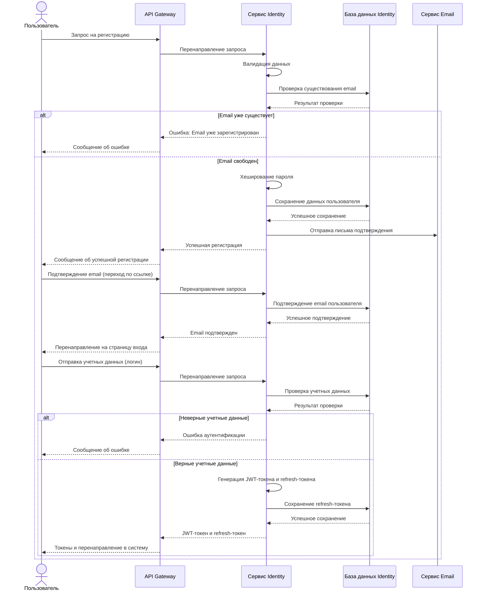
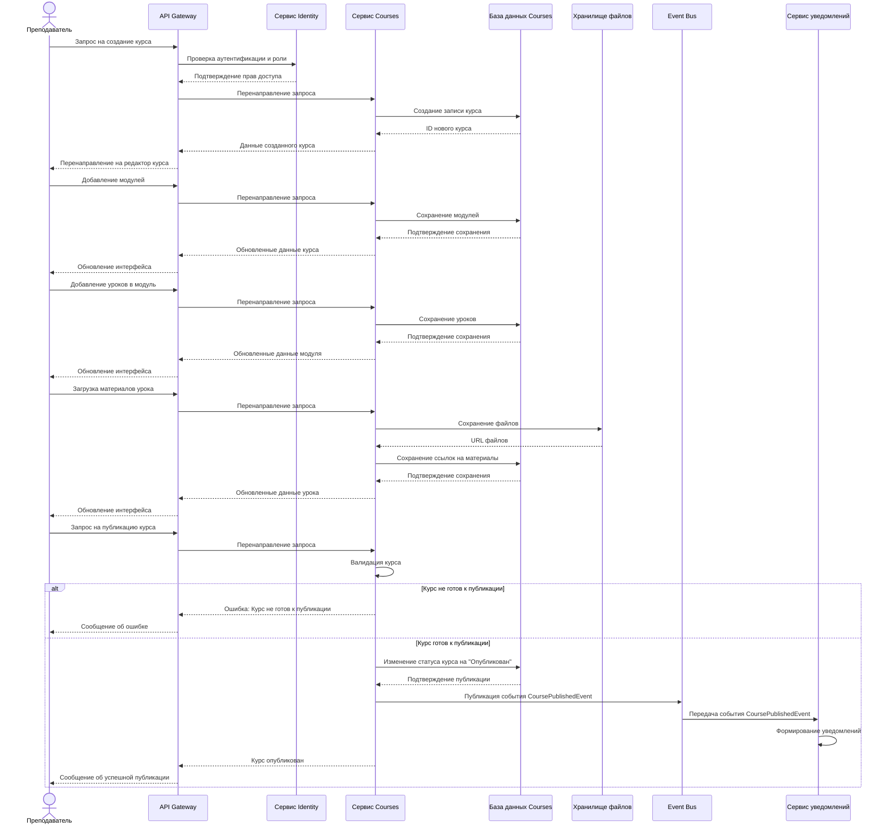
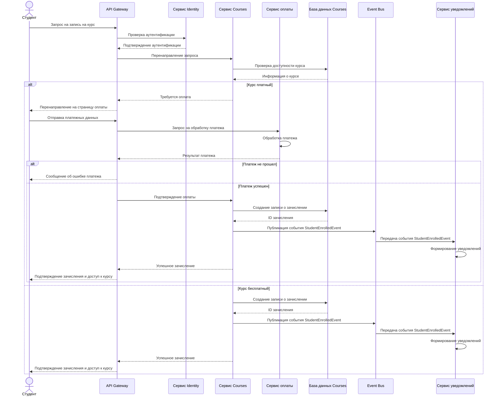
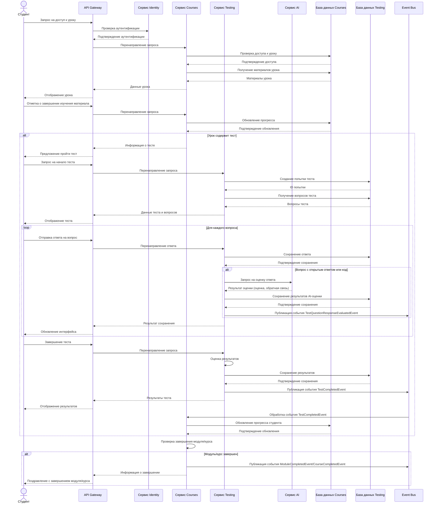
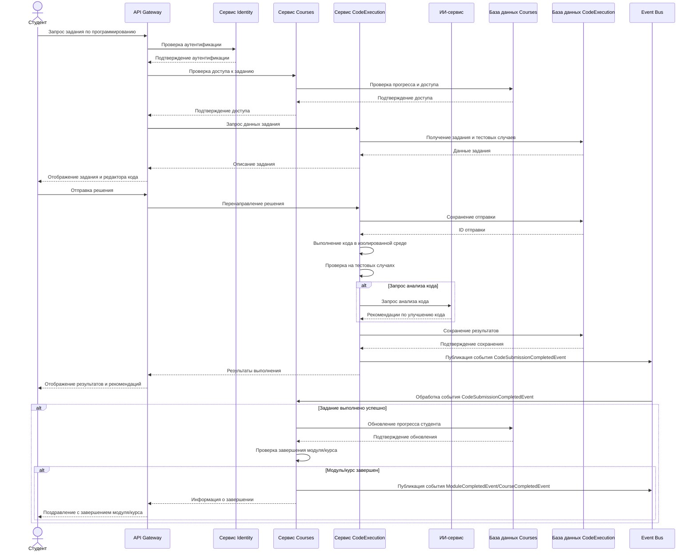
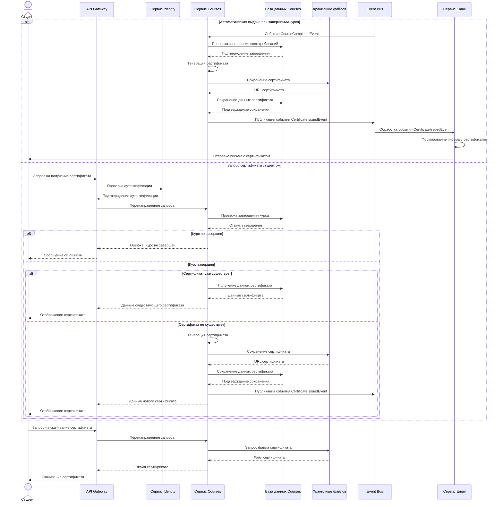
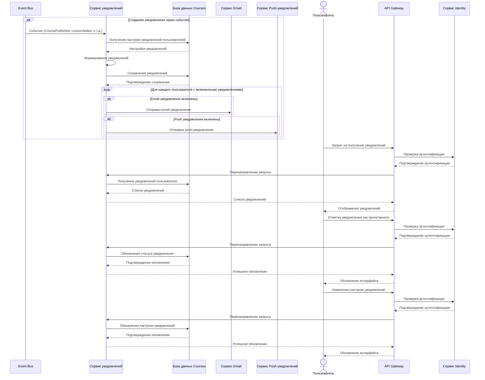
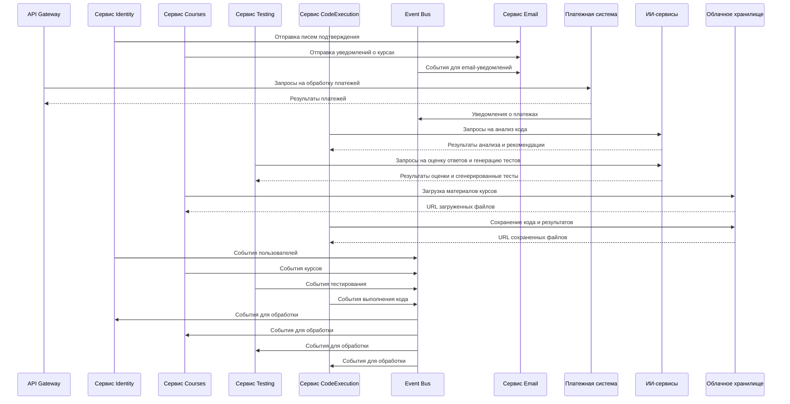
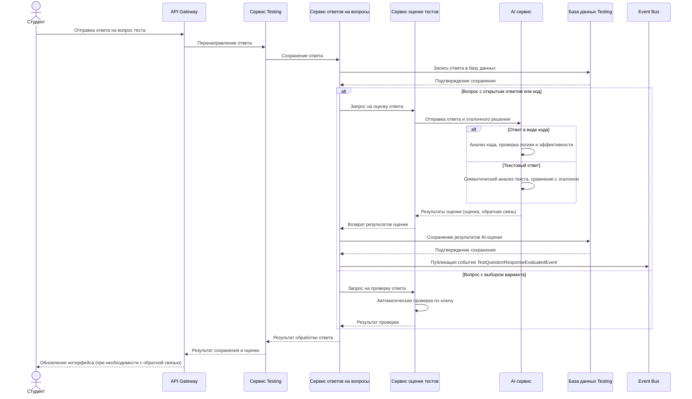

# Диаграммы последовательности AiTestPlatform

В этом документе представлены диаграммы последовательности (Sequence Diagrams) для визуализации взаимодействия компонентов системы AiTestPlatform.

## Содержание

1. [Регистрация и аутентификация пользователя](#регистрация-и-аутентификация-пользователя)
2. [Создание и публикация курса](#создание-и-публикация-курса)
3. [Запись студента на курс](#запись-студента-на-курс)
4. [Прохождение урока и тестирование](#прохождение-урока-и-тестирование)
5. [Выполнение задания по программированию](#выполнение-задания-по-программированию)
6. [Получение сертификата](#получение-сертификата)
7. [Обработка уведомлений](#обработка-уведомлений)
8. [Интеграция с внешними системами](#интеграция-с-внешними-системами)
9. [Оценка ответов на тесты с использованием AI](#оценка-ответов-на-тесты-с-использованием-ai)

## Регистрация и аутентификация пользователя

## Создание и публикация курса

## Запись студента на курс

## Прохождение урока и тестирование

## Выполнение задания по программированию

## Получение сертификата

## Обработка уведомлений

## Интеграция с внешними системами

## Оценка ответов на тесты с использованием AI

## Заключение

Диаграммы последовательности (Sequence Diagrams) предоставляют детальное представление о взаимодействии компонентов системы AiTestPlatform во времени. Они помогают понять:

1. Порядок взаимодействия между компонентами системы
2. Обмен сообщениями между участниками процесса
3. Альтернативные потоки выполнения в зависимости от условий
4. Временную последовательность операций

Эти диаграммы являются важным инструментом для разработчиков, позволяя им лучше понять динамическое поведение системы и взаимодействие между ее компонентами.