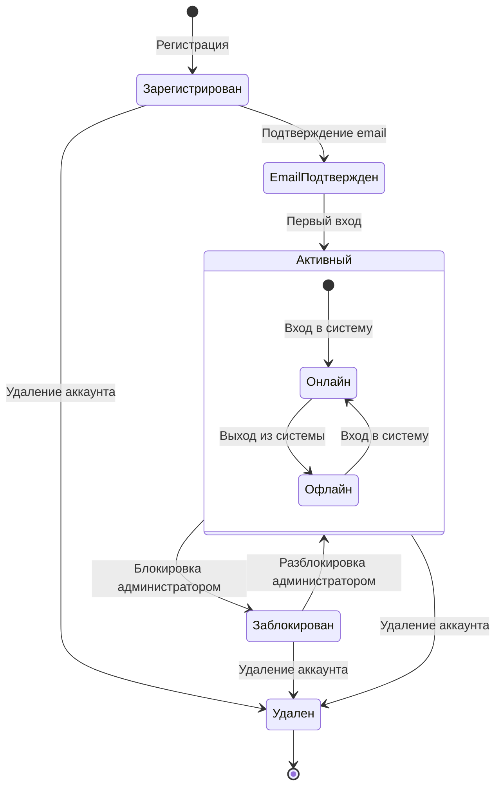
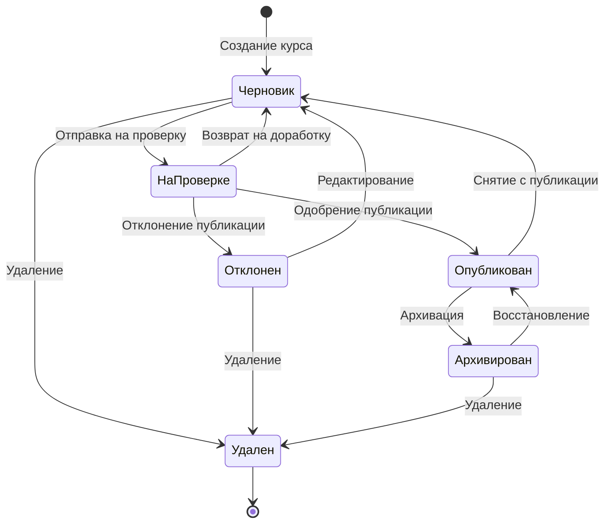
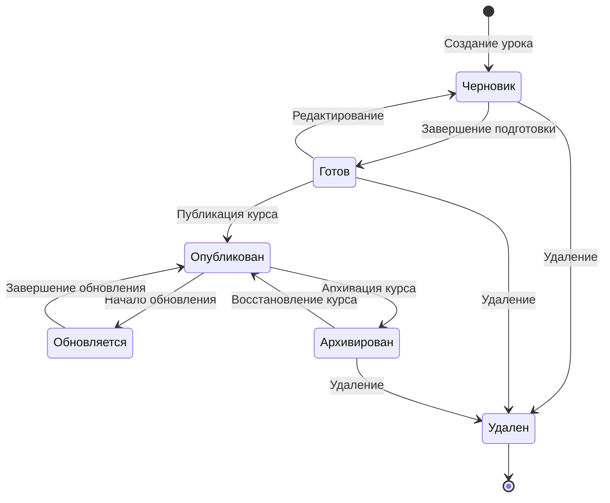
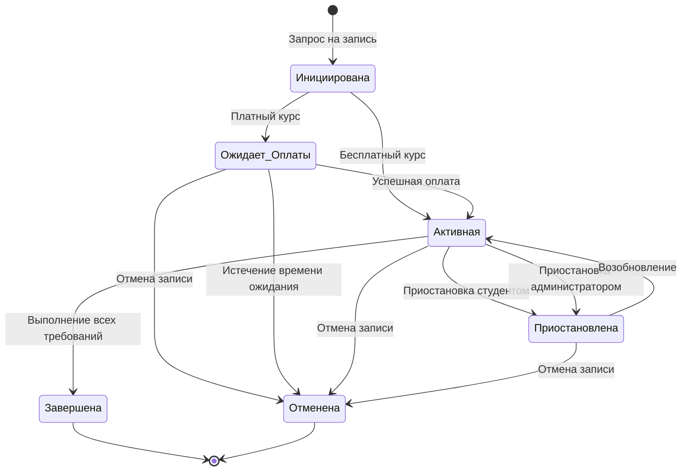
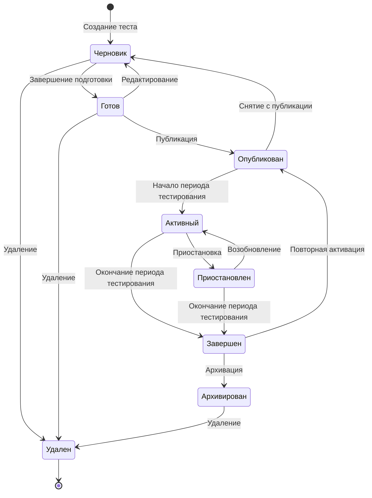
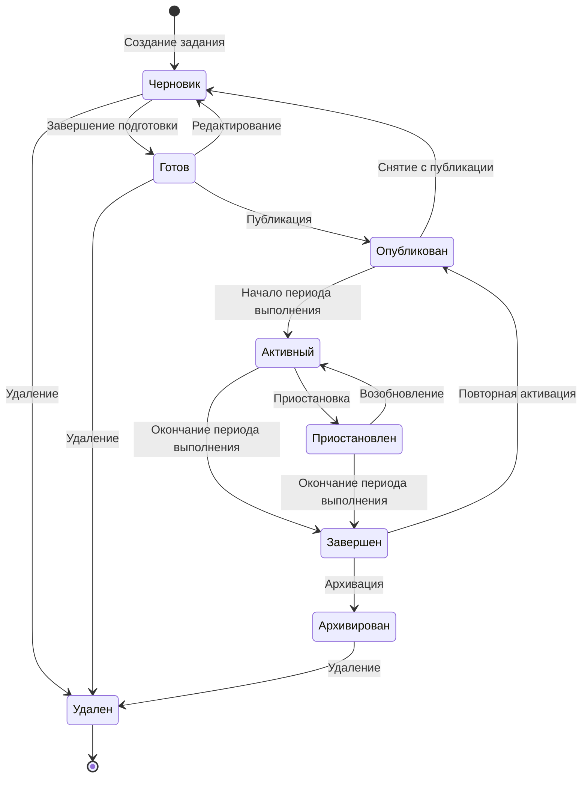
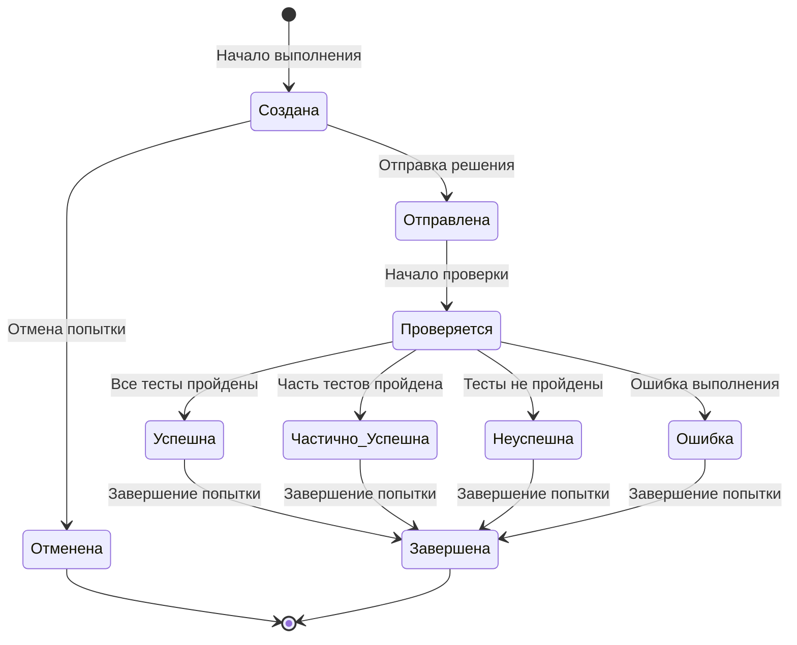
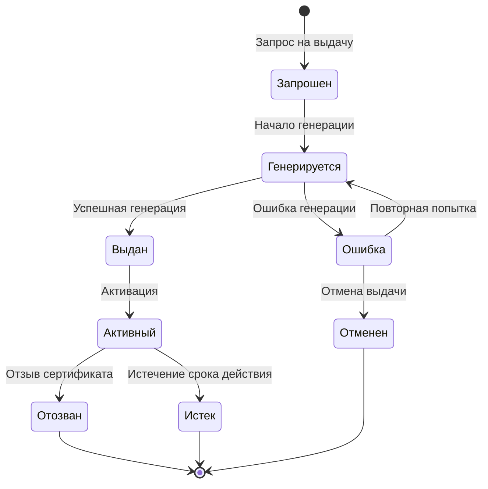
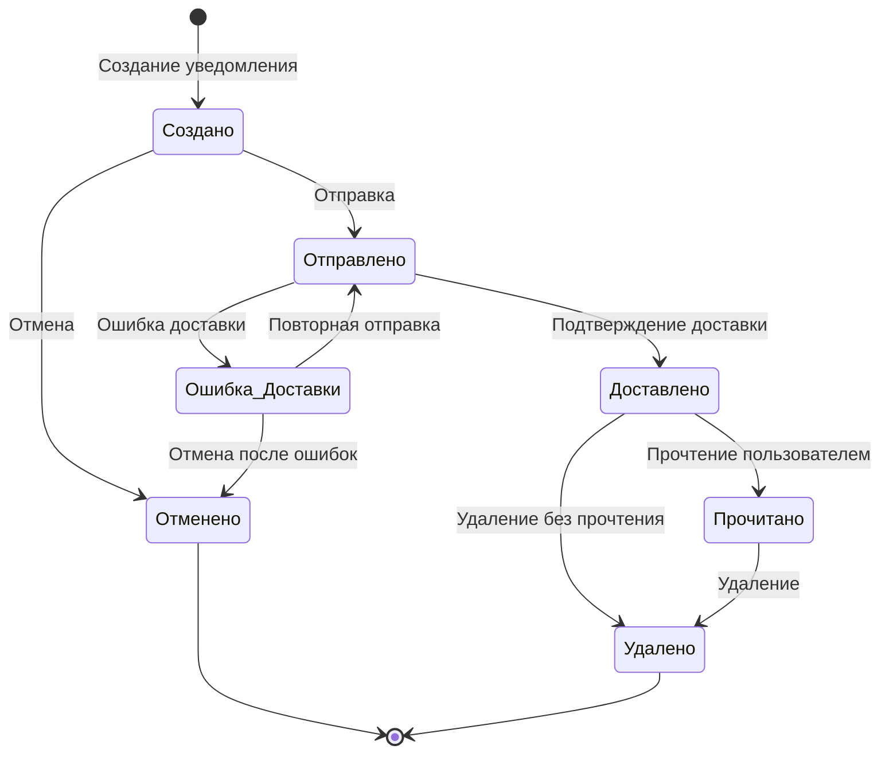

# Диаграммы состояний AiTestPlatform

В этом документе представлены диаграммы состояний (State Diagrams) для визуализации жизненного цикла ключевых сущностей системы AiTestPlatform.

## Содержание

1. [Жизненный цикл пользователя](#жизненный-цикл-пользователя)
2. [Жизненный цикл курса](#жизненный-цикл-курса)
3. [Жизненный цикл урока](#жизненный-цикл-урока)
4. [Жизненный цикл записи на курс](#жизненный-цикл-записи-на-курс)
5. [Жизненный цикл теста](#жизненный-цикл-теста)
6. [Жизненный цикл задания по программированию](#жизненный-цикл-задания-по-программированию)
7. [Жизненный цикл сертификата](#жизненный-цикл-сертификата)
8. [Жизненный цикл уведомления](#жизненный-цикл-уведомления)

## Жизненный цикл пользователя

## Жизненный цикл курса

## Жизненный цикл урока

## Жизненный цикл записи на курс

## Жизненный цикл теста

## Жизненный цикл задания по программированию

## Жизненный цикл попытки выполнения задания

## Жизненный цикл сертификата

## Жизненный цикл уведомления

## Заключение

Диаграммы состояний (State Diagrams) предоставляют наглядное представление о жизненном цикле ключевых сущностей системы AiTestPlatform. Они помогают понять:

1. Возможные состояния, в которых может находиться сущность
2. События, которые вызывают переход из одного состояния в другое
3. Последовательность изменения состояний в течение жизненного цикла
4. Конечные состояния, в которых завершается жизненный цикл

Эти диаграммы являются важным инструментом для разработчиков и аналитиков, позволяя им лучше понять поведение системы и правильно реализовать бизнес-логику, связанную с изменением состояний сущностей.