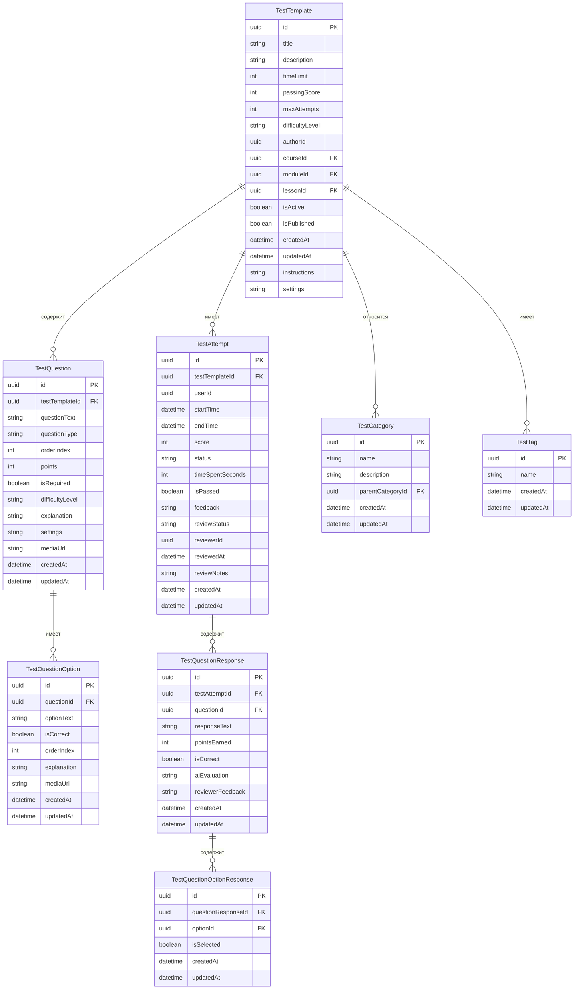

# Схема базы данных микросервиса Testing

В этом документе описана структура базы данных для микросервиса Testing в системе AiTestPlatform.

## ER-диаграмма



## Описание таблиц

### TestTemplate
Содержит шаблоны тестов, которые могут быть назначены курсам, модулям или урокам.

| Поле | Тип | Описание |
|------|-----|----------|
| id | uuid | Первичный ключ |
| title | string | Название теста |
| description | string | Описание теста |
| timeLimit | int | Ограничение времени в минутах |
| passingScore | int | Проходной балл |
| maxAttempts | int | Максимальное количество попыток |
| difficultyLevel | string | Уровень сложности (Easy, Medium, Hard) |
| authorId | uuid | ID автора теста |
| courseId | uuid | ID курса (может быть null) |
| moduleId | uuid | ID модуля (может быть null) |
| lessonId | uuid | ID урока (может быть null) |
| isActive | boolean | Активен ли тест |
| isPublished | boolean | Опубликован ли тест |
| createdAt | datetime | Дата создания |
| updatedAt | datetime | Дата обновления |
| instructions | string | Инструкции для прохождения теста |
| settings | string | JSON с настройками теста |

### TestQuestion
Содержит вопросы, которые входят в тест.

| Поле | Тип | Описание |
|------|-----|----------|
| id | uuid | Первичный ключ |
| testTemplateId | uuid | ID шаблона теста |
| questionText | string | Текст вопроса |
| questionType | string | Тип вопроса (MultipleChoice, SingleChoice, Text, Code) |
| orderIndex | int | Порядковый номер вопроса |
| points | int | Количество баллов за вопрос |
| isRequired | boolean | Обязательный ли вопрос |
| difficultyLevel | string | Уровень сложности вопроса |
| explanation | string | Объяснение правильного ответа |
| settings | string | JSON с настройками вопроса |
| mediaUrl | string | URL медиа-файла (если есть) |
| createdAt | datetime | Дата создания |
| updatedAt | datetime | Дата обновления |

### TestQuestionOption
Содержит варианты ответов для вопросов с выбором.

| Поле | Тип | Описание |
|------|-----|----------|
| id | uuid | Первичный ключ |
| questionId | uuid | ID вопроса |
| optionText | string | Текст варианта ответа |
| isCorrect | boolean | Является ли вариант правильным |
| orderIndex | int | Порядковый номер варианта |
| explanation | string | Объяснение для этого варианта |
| mediaUrl | string | URL медиа-файла (если есть) |
| createdAt | datetime | Дата создания |
| updatedAt | datetime | Дата обновления |

### TestAttempt
Содержит информацию о попытках прохождения теста.

| Поле | Тип | Описание |
|------|-----|----------|
| id | uuid | Первичный ключ |
| testTemplateId | uuid | ID шаблона теста |
| userId | uuid | ID пользователя |
| startTime | datetime | Время начала попытки |
| endTime | datetime | Время окончания попытки |
| score | int | Набранные баллы |
| status | string | Статус (InProgress, Completed, Abandoned) |
| timeSpentSeconds | int | Время, затраченное на тест в секундах |
| isPassed | boolean | Пройден ли тест |
| feedback | string | Обратная связь от системы |
| reviewStatus | string | Статус проверки (NotReviewed, InReview, Reviewed) |
| reviewerId | uuid | ID проверяющего |
| reviewedAt | datetime | Время проверки |
| reviewNotes | string | Заметки проверяющего |
| createdAt | datetime | Дата создания |
| updatedAt | datetime | Дата обновления |

### TestQuestionResponse
Содержит ответы пользователя на вопросы теста.

| Поле | Тип | Описание |
|------|-----|----------|
| id | uuid | Первичный ключ |
| testAttemptId | uuid | ID попытки теста |
| questionId | uuid | ID вопроса |
| responseText | string | Текст ответа (для текстовых вопросов) |
| pointsEarned | int | Заработанные баллы |
| isCorrect | boolean | Правильный ли ответ |
| aiEvaluation | string | Оценка ИИ (для текстовых ответов) |
| reviewerFeedback | string | Обратная связь от проверяющего |
| createdAt | datetime | Дата создания |
| updatedAt | datetime | Дата обновления |

### TestQuestionOptionResponse
Содержит выбранные пользователем варианты ответов.

| Поле | Тип | Описание |
|------|-----|----------|
| id | uuid | Первичный ключ |
| questionResponseId | uuid | ID ответа на вопрос |
| optionId | uuid | ID варианта ответа |
| isSelected | boolean | Выбран ли вариант |
| createdAt | datetime | Дата создания |
| updatedAt | datetime | Дата обновления |

### TestCategory
Содержит категории тестов для их классификации.

| Поле | Тип | Описание |
|------|-----|----------|
| id | uuid | Первичный ключ |
| name | string | Название категории |
| description | string | Описание категории |
| parentCategoryId | uuid | ID родительской категории (для иерархии) |
| createdAt | datetime | Дата создания |
| updatedAt | datetime | Дата обновления |

### TestTag
Содержит теги для маркировки тестов.

| Поле | Тип | Описание |
|------|-----|----------|
| id | uuid | Первичный ключ |
| name | string | Название тега |
| createdAt | datetime | Дата создания |
| updatedAt | datetime | Дата обновления |

## Индексы

- TestTemplate: индексы по courseId, moduleId, lessonId, authorId
- TestQuestion: индекс по testTemplateId
- TestQuestionOption: индекс по questionId
- TestAttempt: индексы по testTemplateId, userId
- TestQuestionResponse: индексы по testAttemptId, questionId
- TestQuestionOptionResponse: индексы по questionResponseId, optionId
- TestCategory: индекс по parentCategoryId

## Миграции Entity Framework Core

Для создания и обновления базы данных используйте следующие команды Entity Framework Core:

```bash
# Создание миграции
dotnet ef migrations add InitialTestingSchema --project src/Services/Testing/Testing.Infrastructure --startup-project src/Services/Testing/Testing.API

# Применение миграции
dotnet ef database update --project src/Services/Testing/Testing.Infrastructure --startup-project src/Services/Testing/Testing.API
```